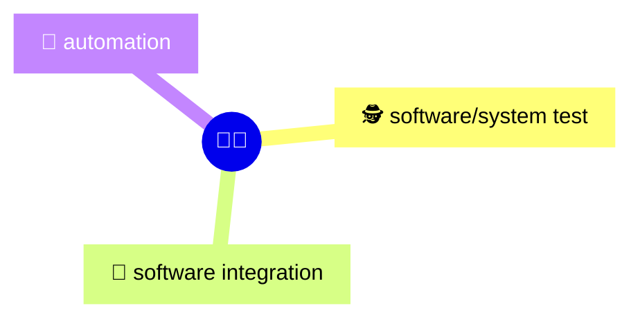
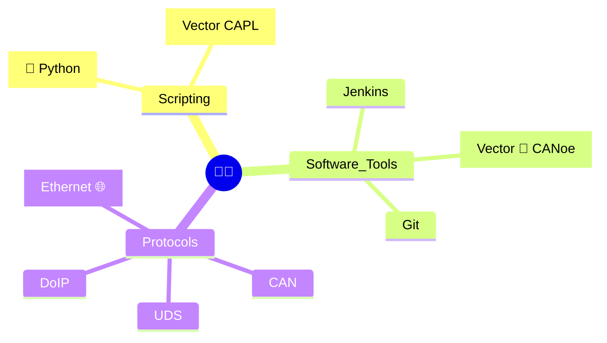
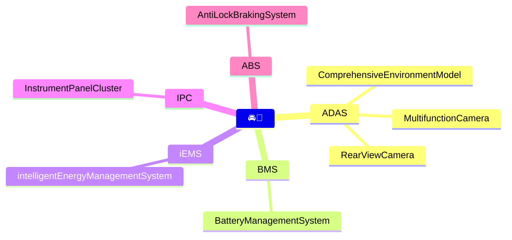
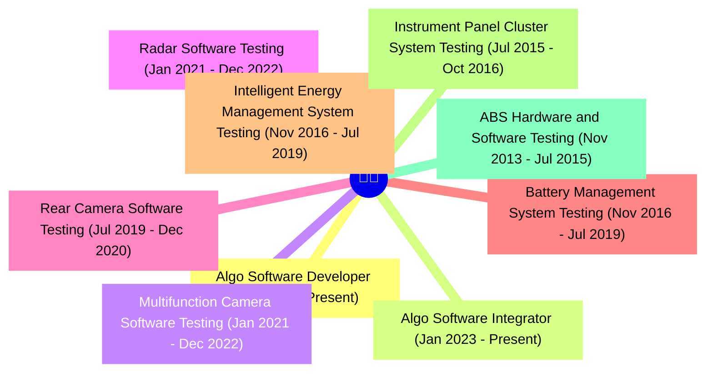

# My Profile

👋 Hi, I'm ✨[Chaitanya Reddy](https://www.linkedin.com/in/chaitu-ycr/)✨

- I'm a full-time 🚗 automotive software/system tester and integrator
- developed 🔧 tools and 🧰 packages using Python
- streamlined software/system test & integration workflows using jenkins/github actions 🚀
- transformed boring 🥱 tasks into efficient processes

## Expertise

## Skills

## Worked on below Automotive Domains

## Professional Experience

## Professional Certifications 📜

- ISTQB Foundation Level

## Education

- 2019 - 2013:
  - 🎓 Bachelor Of Technology in Electronics and Communication Engineering

## My open source GitHub Projects

- [py_canoe](https://github.com/chaitu-ycr/py_canoe.git)
- [py_canalyzer](https://github.com/chaitu-ycr/py_canalyzer.git)
- [can_log_analyzer](https://github.com/chaitu-ycr/can_log_analyzer.git)
- [canmatrix_webapp](https://github.com/chaitu-ycr/canmatrix_webapp.git)
- [tenma_ps](https://github.com/chaitu-ycr/tenma_ps.git)
- [hid_usb_relay](https://github.com/chaitu-ycr/hid_usb_relay.git)
- [kmtronic_usb_relay](https://github.com/chaitu-ycr/kmtronic_usb_relay.git)
- [py_clocks](https://github.com/chaitu-ycr/py_clocks.git)
- I am maintaining some of my learnings 🤓 📗 here 👉 [🔗 chaitu-ycr/docs](https://github.com/chaitu-ycr/chaitu-ycr/tree/main/docs)
- All GitHub repositories created by me [🔗 click here](https://github.com/chaitu-ycr?tab=repositories)

---
[LinkedIn](https://www.linkedin.com/in/chaitu-ycr/)
&nbsp;&nbsp;&nbsp;&nbsp;&nbsp;&nbsp;&nbsp;&nbsp;&nbsp;&nbsp;
[GitHub](https://github.com/chaitu-ycr)
&nbsp;&nbsp;&nbsp;&nbsp;&nbsp;&nbsp;&nbsp;&nbsp;&nbsp;&nbsp;
[YouTube](https://www.youtube.com/@chaitu-ycr)▶️
&nbsp;&nbsp;&nbsp;&nbsp;&nbsp;&nbsp;&nbsp;&nbsp;&nbsp;&nbsp;
[Google](https://www.google.com/search?q=chaitu-ycr)🔍
&nbsp;&nbsp;&nbsp;&nbsp;&nbsp;&nbsp;&nbsp;&nbsp;&nbsp;&nbsp;
