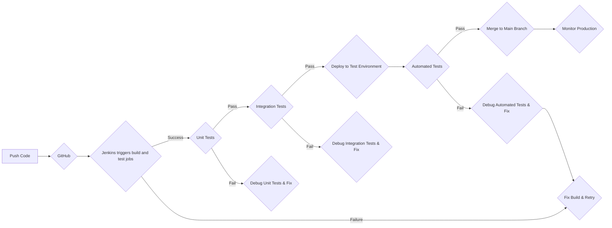
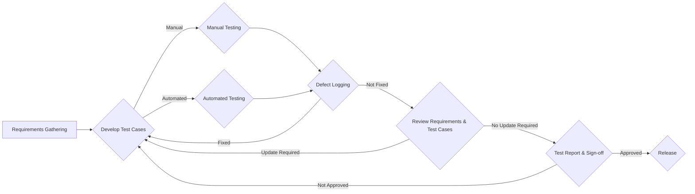

# My Profile

- 👋 I’m ✨[Chaitanya Reddy](https://www.linkedin.com/in/chaitu-ycr/)✨ a full-time automotive Software & System Tester 😎
- Worked in `ADAS`, `Battery Management System`, `Instrument Cluster` and `braking`.
- Enjoyed working in `software & system test 🕵` ➕ `Automation 👨‍💻`
- Leveraged skills like `Vector CANoe`, `CAPL`, `CAN`, `Ethernet`, `UDS`, `DoIP`, `Python 🐍`, `Jenkins`, `Git`, `Testing`, `Automation` and `Problem Solving`
- Automated boring 🥱 stuff using `Python 🐍` and `CAPL` scripting 👨‍💻
- Created tools 🤖 and packages 🧰 using 🐍 programming
- Automated software/system test & integration workflows using Jenkins 🛠️🚀
- Test & Automation enthusiast who drives Efficiency & Quality
- Passionate about Automotive 🚗 Software & System Testing
- Created [py_canoe](https://github.com/chaitu-ycr/py_canoe) & [py_canalyzer](https://github.com/chaitu-ycr/py_canalyzer) packages and hosted in GitHub

## Education

- 2019 - 2013
    - Bachelor Of Technology
       - Electronics and Communication Engineering

## Professional Experience

- Jan 2023 - Present
    - Comprehensive Environment Model Software Integrator
        - Continuous Integration
        - Integration Test and Automation
- Jan 2021 - Dec 2022
    - Multifunction Camera Software Testing
        - Diagnostics
    - Radar Software Testing
        - COM, Diagnostics
- Jul 2019 - Dec 2020
    - Rear Camera Software Testing
        - System State Controller
        - Bootloader
        - Diagnostics
- Nov 2016 - Jul 2019
    - Battery Management System (BMS) Testing
    - Intelligent Energy Management System (iEMS) Testing
- Jul 2015 - Oct 2016
    - Instrument Panel Cluster System Testing
- Nov 2013 - Jul 2015
    - ABS Hardware and Software Testing

### software integration and test workflow

### software/system testing workflow

## Professional Certifications

- ISTQB Foundation Level

## My open source GitHub Projects:

- [py_canoe](https://github.com/chaitu-ycr/py_canoe)
- [py_canalyzer](https://github.com/chaitu-ycr/py_canalyzer)
- here 👇 iam maintaining some of my learning 🤓 📗
    - [git_notes](https://github.com/chaitu-ycr/git_notes)
    - [python_notes](https://github.com/chaitu-ycr/python_notes)
    - [vector_tool_notes](https://github.com/chaitu-ycr/vector_tool_notes)
- All GitHub repositories created by me 👉 [click here](https://github.com/chaitu-ycr?tab=repositories)

---

| [LinkedIn](https://www.linkedin.com/in/chaitu-ycr/) | [GitHub](https://github.com/chaitu-ycr) | [YouTube ▶️](https://www.youtube.com/@chaitu-ycr) | [Google](https://www.google.com/search?q=chaitu-ycr) |
|---------|---------|---------|---------|
