# My Profile

👋 Hi, I'm ✨[Chaitanya Reddy](https://www.linkedin.com/in/chaitu-ycr/)✨

- I'm a full-time 🚗 automotive software/system tester and integrator
- developed 🔧 tools and 🧰 packages with Python, including [py_canoe](https://github.com/chaitu-ycr/py_canoe)
- streamlined software/system test & integration workflows with jenkins/github actions 🚀
- transformed boring 🥱 tasks into efficient processes

## Expertise

```mermaid
mindmap
  Expertise((🧑‍🔬))
    SoftwareSystemTest["🕵 software/system test"]
    SoftwareIntegration["🔄 software integration"]
    Automation["🤖 automation"]
```

## Skills

```mermaid
mindmap
  Skills((🤹💡))
    Scripting
      Python["🐍 Python"]
      VectorCAPL["Vector CAPL"]
    Software_Tools
      CANoe["Vector 🛶 CANoe"]
      Jenkins
      Git
    Protocols
      CAN
      UDS
      DoIP
      Ethernet["Ethernet 🌐"]
```

## Worked on below Automotive Domains

```mermaid
mindmap
  🚘🚗
    ADAS
      ComprehensiveEnvironmentModel
      MultifunctionCamera
      RearViewCamera
    BMS
      BatteryManagementSystem
    iEMS
      intelligentEnergyManagementSystem
    IPC
      InstrumentPanelCluster
    ABS
      AntiLockBrakingSystem
```

## Professional Experience

```mermaid
mindmap
  Experience((🏃‍➡️))
    Algo_Software_Developer["Algo Software Developer (Jan 2023 - Present)"]
    Algo_Software_Integrator["Algo Software Integrator (Jan 2023 - Present)"]
    Multifunction_Camera_Software_Testing["Multifunction Camera Software Testing (Jan 2021 - Dec 2022)"]
    Radar_Software_Testing["Radar Software Testing (Jan 2021 - Dec 2022)"]
    Rear_Camera_Software_Testing["Rear Camera Software Testing (Jul 2019 - Dec 2020)"]
    BMS_Testing["Battery Management System Testing (Nov 2016 - Jul 2019)"]
    iEMS_Testing["Intelligent Energy Management System Testing (Nov 2016 - Jul 2019)"]
    Instrument_Panel_Cluster_System_Testing["Instrument Panel Cluster System Testing (Jul 2015 - Oct 2016)"]
    ABS_Hardware_and_Software_Testing["ABS Hardware and Software Testing (Nov 2013 - Jul 2015)"]
```

## Professional Certifications 📜

- ISTQB Foundation Level

## Education

- 2019 - 2013:
  - 🎓 Bachelor Of Technology in Electronics and Communication Engineering

## My open source GitHub Projects

- [py_canoe](https://github.com/chaitu-ycr/py_canoe)
- here 👇 i am maintaining some of my learnings 🤓 📗
  - 📚 [git_notes](https://chaitu-ycr.github.io/git_notes/)
  - 📚 [yaml_notes](https://chaitu-ycr.github.io/yaml_notes/)
  - 📚 [python_notes](https://chaitu-ycr.github.io/python_notes/)
  - 📚 [vector_tool_notes](https://github.com/chaitu-ycr/vector_tool_notes)
- All GitHub repositories created by me [🔗 click here](https://github.com/chaitu-ycr?tab=repositories)

---
[LinkedIn](https://www.linkedin.com/in/chaitu-ycr/)
&nbsp;&nbsp;&nbsp;&nbsp;&nbsp;&nbsp;&nbsp;&nbsp;&nbsp;&nbsp;
[GitHub](https://github.com/chaitu-ycr)
&nbsp;&nbsp;&nbsp;&nbsp;&nbsp;&nbsp;&nbsp;&nbsp;&nbsp;&nbsp;
[YouTube](https://www.youtube.com/@chaitu-ycr)▶️
&nbsp;&nbsp;&nbsp;&nbsp;&nbsp;&nbsp;&nbsp;&nbsp;&nbsp;&nbsp;
[Google](https://www.google.com/search?q=chaitu-ycr)🔍
&nbsp;&nbsp;&nbsp;&nbsp;&nbsp;&nbsp;&nbsp;&nbsp;&nbsp;&nbsp;
