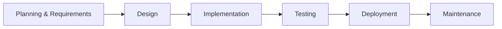

# 🚀 Software Development Life Cycle (SDLC)

> **Definition:**  
> The Software Development Life Cycle (SDLC) is a standardized process used by software teams to design, develop, test, deploy, and maintain high-quality software efficiently and predictably.

---

## 🎯 Purpose

The SDLC provides a structured approach to software development, ensuring that business needs are met, risks are managed, and quality is maintained throughout the project.

---

## 🌍 Applicability

SDLC is used in all types of software projects—ranging from small apps to large enterprise systems—across industries such as finance, healthcare, retail, and technology.

---

## 🗺️ SDLC Overview

The SDLC is a systematic process for building software that ensures quality, efficiency, and alignment with business goals. It provides a framework for managing both technical and managerial aspects of software projects.

---

## 👥 Key Stakeholders & Roles

| Stakeholder         | Role/Responsibility                          |
|---------------------|----------------------------------------------|
| Project Managers    | Oversee planning and execution               |
| Business Analysts   | Gather and document requirements             |
| Developers          | Design and implement the software            |
| Testers/QA          | Validate functionality and quality           |
| End Users           | Provide feedback and validate requirements   |
| Operations/Support  | Maintain and support the system post-deployment |

---

## 📦 Common Deliverables per Phase

| Phase           | Typical Deliverables                        |
|-----------------|---------------------------------------------|
| Planning        | Project charter, feasibility study, schedule|
| Requirements    | Requirements specification, use cases       |
| Design          | Architecture diagrams, UI mockups, DB schema|
| Implementation  | Source code, build scripts                  |
| Testing         | Test plans, test cases, defect logs         |
| Deployment      | Release notes, deployment scripts           |
| Maintenance     | Patch notes, updated documentation          |

---

## 🏗️ SDLC Phases & Key Activities

| Phase                        | Key Activities                                                                 |
|------------------------------|-------------------------------------------------------------------------------|
| Planning & Requirements      | Define scope, goals, feasibility; gather/document requirements                |
| Design                      | Create system architecture (UI, DB, APIs); specify technologies/tools          |
| Implementation (Coding)      | Developers write code based on design specifications                          |
| Testing                      | Verify functionality (unit, integration, system, UAT); identify/fix defects   |
| Deployment                   | Release software to production (phased rollout or full launch)                |
| Maintenance                  | Provide updates, patches, and enhancements                                    |

---

## ⚠️ Typical Challenges

| Challenge                              | Description                                      |
|-----------------------------------------|--------------------------------------------------|
| Incomplete or changing requirements     | Requirements not fully defined or frequently change |
| Communication gaps between stakeholders | Misunderstandings or lack of clarity             |
| Underestimating time or resources       | Inaccurate project planning                      |
| Insufficient testing or documentation   | Leads to defects and maintenance issues          |
| Resistance to process changes           | Difficulty in adopting new or improved processes |

---

## 🏆 Popular SDLC Models

| Model           | Key Characteristics                          | Best For                                 |
|-----------------|---------------------------------------------|------------------------------------------|
| Waterfall       | Linear, sequential phases                    | Stable requirements, short projects      |
| V-Shaped        | Testing parallel to development              | High-reliability systems (e.g., medical) |
| Prototyping     | Iterative user feedback loops                | Unclear or evolving requirements         |
| RAD             | Rapid delivery via workshops and tools       | Modular, user-driven projects            |
| Incremental     | Deliver functional pieces incrementally      | Large projects needing early releases    |
| Spiral          | Risk-driven iterative cycles                 | Complex, high-risk projects              |
| Agile           | Flexible, iterative, customer-collaborative  | Dynamic requirements (e.g., startups)    |

---

## 💡 Why SDLC Matters

| Benefit           | Description                                                      |
|-------------------|------------------------------------------------------------------|
| Predictability    | Clear milestones and deliverables                                |
| Quality Control   | Testing and validation at each stage                             |
| Risk Management   | Early issue identification (e.g., Spiral model)                  |
| Cost Efficiency   | Reduces rework through structured planning                       |

---

## 🧭 Choosing the Right Model

| Factor             | Recommended Model(s)         |
|--------------------|-----------------------------|
| Project size       | Agile (small), Waterfall (large) |
| Requirement stability | Waterfall (fixed), Agile/Prototyping (volatile) |
| Risk tolerance     | Spiral (high risk), Incremental (phased risk) |
| Time constraints   | RAD (speed), Waterfall (predictable timelines) |

---

## 📚 Detailed Model Explanations

| Model         | Characteristics | Pros | Cons | When to Use |
|---------------|-----------------|------|------|-------------|
| **Waterfall** | Strict linear progression, each phase must be 100% complete before next begins, comprehensive documentation | Easy to understand/manage, clear milestones, good for regulated industries | Inflexible to changes, late testing, poor fit for complex projects | Fixed/well-documented requirements, short duration, similar previous projects |
| **V Model** | Verification and validation for each phase, testing planned parallel to development, strict discipline | Early defect detection, high reliability, clear accountability | No iteration flexibility, high documentation overhead | Mission-critical systems, reliability > speed, aerospace/medical devices |
| **Prototyping** | Rapid prototype development, user feedback-driven iterations, evolutionary approach | Early user validation, reduced requirement risks, good for UI-heavy apps | Potential scope creep, documentation challenges | Unclear requirements, UI development, proof-of-concept projects |
| **RAD** | Time-boxed development (60-90 days), component-based, heavy user involvement | Faster delivery, high customer satisfaction, reusable components | Requires skilled team, not for high complexity | Well-defined scope, skilled resources, web/mobile apps |
| **Incremental** | Divide system into modules, deliver working increments, prioritize high-risk features | Early ROI, risk distribution, flexible planning | Needs strong architecture, integration challenges | Large systems, partial funding, evolving requirements |
| **Spiral** | Risk-driven iterations, combines prototyping + waterfall, 4 quadrants per cycle | Early risk identification, flexible, good for R&D | Complex to manage, expensive for small projects | High-risk projects, research, long-term developments |
| **Agile** | Iterative (2-4 week sprints), customer collaboration, adaptive planning | Rapid delivery, embraces changes, high transparency | Needs disciplined team, hard to predict timelines | Dynamic requirements, customer availability, startup environments |

**Agile Key Methods:**  
- **Scrum:** Sprints with daily standups  
- **XP:** Pair programming, TDD  
- **Kanban:** Visual workflow  

---

## 🧩 Model Selection Guide

| Factor         | Recommended Model         |
|----------------|--------------------------|
| Fixed Budget   | Waterfall, V-Shaped      |
| Changing Reqs  | Agile, Prototyping       |
| High Risk      | Spiral, Incremental      |
| Tight Deadline | RAD, Agile               |
| Large Team     | Waterfall, Incremental   |
| Small Team     | Agile, Prototyping       |

---

## 📝 Key Takeaways

- SDLC standardizes software development processes.
- No "one-size-fits-all" model—select based on project needs.
- Hybrid approaches (e.g., Agile + Waterfall) are increasingly common.

---

## 🏁 Conclusion

Understanding SDLC models enables teams to:
- Select the optimal approach
- Anticipate challenges
- Deliver quality software efficiently

The key is matching model characteristics to your specific project constraints and requirements.

---

## 🔗 References & Further Reading

- [IEEE 12207: Software Life Cycle Processes](https://ieeexplore.ieee.org/document/720574)
- [ISO/IEC 12207: Software Life Cycle Processes](https://www.iso.org/standard/43447.html)
- [Agile Manifesto](https://agilemanifesto.org/)

---

## 🖼️ SDLC Phases Diagram

<!-- Optionally, add a diagram here -->
<!--  -->