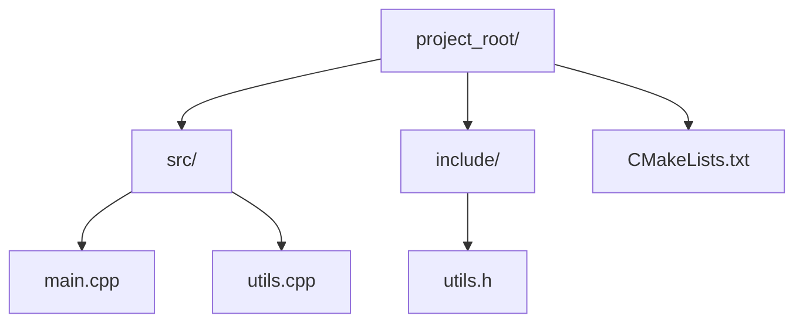

# 🛠️ CMake Basics

## 🚀 Introduction

CMake is a cross-platform build system generator that automates compiling, linking, and managing dependencies. It generates platform-specific build files (e.g., Makefiles, Visual Studio, Ninja, Xcode), making it highly versatile for multi-platform development.

---

## ❓ Why Use a Build System?

| Benefit               | Description                                                         |
|-----------------------|---------------------------------------------------------------------|
| ⚙️ Automation         | Compiles and links code automatically, reducing manual errors.      |
| 🔗 Dependency Mgmt    | Tracks file dependencies and rebuilds only what’s necessary.        |
| 🔄 Reproducibility    | Ensures consistent builds across environments.                      |
| 🧩 Simplified Workflow| Reduces complex build commands to simple, repeatable steps.         |

### 📝 Manual Compilation Example

| Platform | Compile Command(s)                                         | Link Command                                 |
|----------|------------------------------------------------------------|----------------------------------------------|
| Linux    | `g++ -c main.cpp -o main.o`<br>`g++ -c utils.cpp -o utils.o` | `g++ main.o utils.o -o my_program`           |
| Windows  | `cl /c main.cpp /Fo:main.obj`<br>`cl /c utils.cpp /Fo:utils.obj` | `link main.obj utils.obj /OUT:my_program.exe`|

*CMake automates these steps for you.*

---

## 🏗️ CMake vs Other Build Systems

| Build System | Cross-Platform | Notes                                    |
|--------------|----------------|------------------------------------------|
| **CMake**    | ✅             | Generates files for other build systems  |
| Make         | ❌             | Unix-like systems only                   |
| Ninja        | ✅             | Fast; CMake can generate Ninja files     |
| Meson        | ✅             | Modern, often used with Ninja            |
| Bazel        | ✅             | Scalable, multi-language                 |
| SCons        | ✅             | Python-based, less common for C++        |

---

## 💾 Installing CMake

| Platform | Command/Instructions |
|----------|---------------------|
| Linux    | `sudo apt update && sudo apt install cmake` |
| Windows  | Download from [cmake.org](https://cmake.org/download/)<br>`choco install cmake`<br>or use `cmake-gui .` |
| macOS    | `brew install cmake` |
| Python   | `pip install cmake` |
| Conda    | `conda install cmake` |
| Portable | Download binaries from official website |

**Verify Installation:**
```bash
cmake --version
```

---

## 🗂️ Recommended Project Structure



**Directory Layout:**
```
project_root/
  src/
    main.cpp
    utils.cpp
  include/
    utils.h
  CMakeLists.txt
```

---

## 📄 Minimal `CMakeLists.txt`

```cmake
cmake_minimum_required(VERSION 3.10)
project(MyProject)
add_executable(my_program src/main.cpp src/utils.cpp)
target_include_directories(my_program PRIVATE include)
```

---

## ⚙️ CMake Presets

Create a `CMakePresets.json` in your project root:

```json
{
  "version": 3,
  "cmakeMinimumRequired": { "major": 3, "minor": 19, "patch": 0 },
  "configurePresets": [
    {
      "name": "default",
      "generator": "Ninja",
      "description": "Default Ninja build",
      "binaryDir": "${sourceDir}/build"
    }
  ]
}
```

**Usage:**
```bash
cmake --preset=default
cmake --build --preset=default
```

---

## 🔄 Common Build Steps

| Step         | Command (Linux/macOS/Windows)                        |
|--------------|-----------------------------------------------------|
| Configure    | `cmake -S . -B build`                               |
| Build        | `cmake --build build`<br>`cmake --build build --config Release` (Windows) |
| Clean        | Delete `build/` directory                           |
| Install      | `cmake --install build` (if install rules defined)  |
| Specific Target | `cmake --build build --target <target_name>`     |

**Tips:**
- Use `-G` to specify a generator (e.g., Ninja, Visual Studio).
- Set a toolchain: `cmake -DCMAKE_TOOLCHAIN_FILE=toolchain.cmake -S . -B build`
- Set a compiler:
  ```bash
  export CC=clang
  export CXX=clang++
  cmake -S . -B build
  ```

---

## 🏗️ Creating Executables and Libraries

| Command                        | Purpose                        | Example                                      |
|--------------------------------|--------------------------------|----------------------------------------------|
| `add_executable`               | Create executable              | `add_executable(my_program main.cpp)`        |
| `add_library`                  | Create library                 | `add_library(my_library utils.cpp)`          |
| `STATIC`/`SHARED`              | Static/shared lib              | `add_library(my_library STATIC utils.cpp)`   |
| `target_include_directories`   | Add include dirs               | `target_include_directories(my_library PUBLIC include)` |
| `set_target_properties`        | Set properties                 | `set_target_properties(my_program PROPERTIES CXX_STANDARD 17)` |
| `target_link_libraries`        | Link libraries                 | `target_link_libraries(my_program PRIVATE my_library)` |

---

## 🧮 Variables, Lists, and Strings

| Operation         | Example                                                        |
|-------------------|----------------------------------------------------------------|
| Set variable      | `set(MY_VAR "Hello, CMake!")`                                 |
| Append to list    | `list(APPEND MY_LIST "d")`                                    |
| Split string      | `string(REPLACE "," ";" MY_LIST "a,b,c")`                     |
| Join list         | `string(JOIN "," MY_STRING ${MY_LIST})`                       |
| List length       | `list(LENGTH MY_LIST LEN)`                                    |

---

## 🔁 Control Flow, Functions, and Macros

| Feature   | Example |
|-----------|---------|
| If/Else   | `if(WIN32) ... else() ... endif()` |
| Function  | <br>```cmake<br>function(print_message msg)<br>  message(${msg})<br>endfunction()<br>print_message("Hello!")<br>``` |
| Macro     | <br>```cmake<br>macro(print_macro msg)<br>  message(${msg})<br>endmacro()<br>print_macro("Hello!")<br>``` |

- Functions have their own scope; macros do not.

---

## 💾 Cache Variables

| Operation           | Example                                                    |
|---------------------|-----------------------------------------------------------|
| Set cache variable  | `set(MY_VAR "CacheValue" CACHE STRING "A cached variable")`|
| Modify via CLI      | `cmake -DMY_VAR="NewValue" .`                             |
| Edit interactively  | `ccmake .` or `cmake-gui .`                               |
| Remove cache        | Delete `CMakeCache.txt`                                   |

---

## 📦 Installing and Exporting Packages

| Operation           | Example                                                    |
|---------------------|-----------------------------------------------------------|
| Install target      | `install(TARGETS my_library DESTINATION lib)`             |
| Install headers     | `install(DIRECTORY include/ DESTINATION include)`         |
| Export targets      | `install(EXPORT ...)`                                     |
| Set install prefix  | `-DCMAKE_INSTALL_PREFIX=/path/to/install`                 |

**Using Third-Party Packages:**
```cmake
find_package(OpenCV REQUIRED)
target_link_libraries(my_program PRIVATE ${OpenCV_LIBS})
```
- For Boost: `find_package(Boost REQUIRED COMPONENTS filesystem)`
- Use `FetchContent` or `ExternalProject_Add` for dependencies.

---

## 🏷️ Build Types and Modes

| Build Type   | Command                                         |
|--------------|-------------------------------------------------|
| Debug        | `cmake -DCMAKE_BUILD_TYPE=Debug .`              |
| Release      | `cmake -DCMAKE_BUILD_TYPE=Release .`            |
| Multi-config | `cmake --build build --config Debug` (VS/Win)   |

Customize flags: `CMAKE_CXX_FLAGS_DEBUG`, `CMAKE_CXX_FLAGS_RELEASE`

---

## 🧰 Miscellaneous

| Feature         | Example                                   |
|-----------------|-------------------------------------------|
| Comment         | `# This is a comment`                     |
| Script mode     | `cmake -P script.cmake`                   |
| Generate from template | `configure_file()`                  |

---

## 🏅 Best Practices

- **Out-of-source builds:** Always build in a separate directory (e.g., `build/`).
- **Version control:** Add `build/`, `CMakeFiles/`, and `CMakeCache.txt` to `.gitignore`.
- **Documentation:** Use `cmake --help` and [CMake docs](https://cmake.org/cmake/help/latest/).
- **Testing:** Integrate with CTest:
    ```cmake
    enable_testing()
    add_test(NAME my_test COMMAND my_program)
    ```
- **Packaging:** Use `CPack` for installers or archives.

---

## ⚠️ Common Pitfalls

| Pitfall                  | Solution                                                    |
|--------------------------|-------------------------------------------------------------|
| In-source builds         | Use out-of-source builds (`build/` dir)                     |
| Stale cache              | Delete `CMakeCache.txt` or `build/` dir after config/toolchain changes |
| Missing `cmake_minimum_required` | Always specify at the top of `CMakeLists.txt`      |
| Not re-running CMake after changes | Re-run CMake after changing `CMakeLists.txt` or adding/removing files |

---

## 📚 Further Reading

- [CMake documentation](https://cmake.org/cmake/help/latest/)

---

