# 🌱 PlantUML

PlantUML is an open-source tool that lets you create diagrams from simple text!
It's perfect for making UML and other diagrams in docs, wikis, and codebases. 🎨

---

## 🚀 Prerequisites

| Requirement | Details |
|-------------|---------|
| **☕ Java**  | Java 8 or higher is required.<br>Check with:<br> <code>java -version</code><br>If not installed, download from [Adoptium](https://adoptium.net/) or [Oracle](https://www.oracle.com/java/technologies/downloads/). |

---

## ⚡ Quick Start

1. **Download** the latest `plantuml.jar` from the [official website](https://plantuml.com/download).
2. **Create** a `.puml` file with your diagram text.
3. **Generate** an image:
   ```bash
   java -jar plantuml.jar diagram.puml
   ```
   🖼️ You'll get a shiny `.png` file in the same folder!

---

## 🗂️ Supported Diagram Types

PlantUML supports a wide range of diagrams:

| Diagram Type                | Description                              |
|-----------------------------|------------------------------------------|
| 🕒 Sequence diagram         | Visualize interactions in time sequence  |
| 🎭 Use case diagram         | Model system use cases                   |
| 🏷️ Class diagram            | Show classes and relationships           |
| 🧑‍🤝‍🧑 Object diagram         | Show object instances                    |
| 🏃 Activity diagram         | Model workflows                          |
| 🧩 Component diagram        | Show system components                   |
| 🖥️ Deployment diagram        | Model deployment architecture            |
| 🔄 State diagram            | Model state transitions                  |
| ⏱️ Timing diagram            | Visualize timing constraints             |
| 📦 JSON/YAML data           | Visualize data structures                |
| 📚 EBNF diagram             | Grammar representation                   |
| 🔍 Regex diagram            | Visualize regular expressions            |
| 🌐 Network diagram (nwdiag) | Network topologies                       |
| 🖥️ UI mockups (salt)         | Simple UI wireframes                     |
| 🏛️ Archimate diagram         | Enterprise architecture                  |
| 📝 SDL diagram              | Specification and Description Language   |
| 🖼️ Ditaa diagram             | ASCII art diagrams                       |
| 📅 Gantt chart              | Project timelines                        |
| 🕰️ Chronology diagram        | Timeline visualization                   |
| 🧠 Mindmap diagram          | Hierarchical mindmaps                    |
| 🪜 WBS diagram               | Work Breakdown Structure                 |
| ➗ AsciiMath/JLaTeXMath      | Mathematical notation                    |
| 🗃️ IE diagram                | Information Engineering                  |
| 🗂️ ER diagram                | Entity Relationship                      |

---

## ✍️ Usage

1. **Write your diagram** in a `.puml` file using PlantUML syntax.
   Example (Sequence Diagram):

   ```plantuml
   @startuml
   Alice -> Bob: Hello
   Bob -> Alice: Hi!
   @enduml
   ```

2. **Generate the diagram image**:

   ```bash
   java -jar plantuml.jar diagram.puml
   ```

   🖼️ This creates an image file you can embed in docs or slides!

---

## 🎉 Examples

Check out these cool diagrams you can make with PlantUML:

<details>
<summary>🕒 Sequence Diagram</summary>

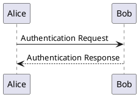
</details>

<details>
<summary>🎭 Use Case Diagram</summary>

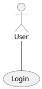
</details>

<details>
<summary>🏷️ Class Diagram</summary>

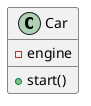
</details>

<details>
<summary>🧑‍🤝‍🧑 Object Diagram</summary>

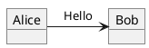
</details>

<details>
<summary>🏃 Activity Diagram</summary>

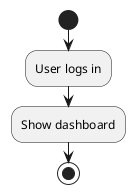
</details>

<details>
<summary>🧩 Component Diagram</summary>

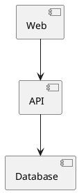
</details>

<details>
<summary>🖥️ Deployment Diagram</summary>

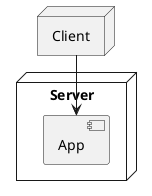
</details>

<details>
<summary>🔄 State Diagram</summary>

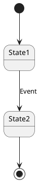
</details>

<details>
<summary>⏱️ Timing Diagram</summary>

```plantuml
@startuml
robust "User" as U
robust "System" as S
U -> S : Request
S -> U : Response
@enduml
```
</details>

<details>
<summary>📅 Gantt Chart</summary>

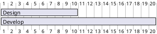
</details>

<details>
<summary>🧠 Mindmap Diagram</summary>

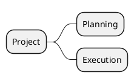
</details>

<details>
<summary>🪜 WBS Diagram</summary>

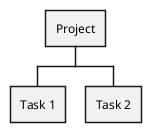
</details>

<details>
<summary>🗂️ ER Diagram</summary>

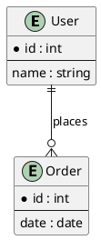
</details>

<details>
<summary>📦 JSON Data Diagram</summary>

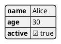
</details>

<details>
<summary>🔍 Regex Diagram</summary>

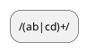
</details>

<details>
<summary>🌐 Network Diagram (nwdiag)</summary>

```plantuml
@startnwdiag
network dmz {
  web;
  db;
}
@endnwdiag
```
</details>

<details>
<summary>🖥️ UI Mockup (salt)</summary>

```plantuml
@startsalt
{
  Button "OK"
  Button "Cancel"
}
@endsalt
```
</details>

---

## 📁 File Structure

Organize your PlantUML files like this:

```
project/
└── diagrams/
    ├── example1.puml
    └── example2.puml
```

---

## 🔌 Integrations

PlantUML works with lots of tools and editors! 🚀

| Tool/Editor         | Integration Method/Extension                |
|---------------------|--------------------------------------------|
| 📝 VS Code          | PlantUML extension                         |
| 💡 IntelliJ IDEA    | PlantUML integration/plugin                |
| 🐘 Eclipse          | PlantUML plugin                            |
| 🗒️ Markdown editors | Direct embedding or plugin support         |
| ⚙️ CI/CD pipelines   | Automated diagram generation               |

See [PlantUML integrations](https://plantuml.com/running) for more.

---

## 🛠️ Troubleshooting

| Issue                        | Solution                                              |
|------------------------------|------------------------------------------------------|
| ❌ `java` not found           | Make sure Java is installed and on your PATH.         |
| 🖼️ No image generated         | Check for errors in your `.puml` file syntax.         |
| 📂 Output file not found      | Run the command in the correct directory.             |

---

## 📜 License

PlantUML is distributed under the [GPL, LGPL, or EPL license](https://plantuml.com/license).
Please review the license terms before using in commercial projects.

---

## 🤝 Support & Contributing

- For questions, visit the [PlantUML Q&A](https://forum.plantuml.net/).
- Contributions welcome via the [official GitHub repo](https://github.com/plantuml/plantuml)! 🎉

---

## 🔗 References

- [🌱 PlantUML Official Website](https://plantuml.com/)
- [📖 PlantUML Language Reference Guide](https://plantuml.com/guide)
```
