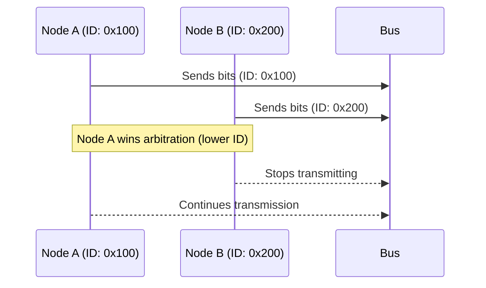
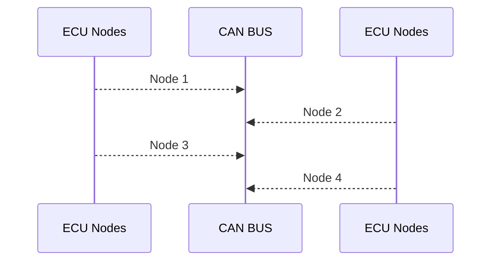

# 🚌 Controller Area Network (CAN)

## Table of Contents
- [Overview](#-overview)
- [CAN Basics](#-can-basics)
- [CAN vs. Other Protocols](#-can-vs-other-protocols)
- [CAN Frame Types & Structure](#-can-frame-types--structure)
- [CAN Identifiers](#-can-identifiers)
- [Bit Rate and Bus Length](#-bit-rate-and-bus-length)
- [Bit Stuffing](#-bit-stuffing)
- [Physical Layer](#-physical-layer)
- [Arbitration & Priority](#-arbitration--priority)
- [Error Detection, States & Handling](#-error-detection-states--handling)
- [CAN FD vs. Classical CAN](#-can-fd-vs-classical-can)
- [Higher Layer Protocols](#-higher-layer-protocols)
- [Fault Tolerance & Recovery](#-fault-tolerance--recovery)
- [Real-Time & Deterministic Behavior](#-real-time--deterministic-behavior)
- [Example: CAN Bus Topology](#-example-can-bus-topology)
- [FAQ](#-frequently-asked-questions)
- [References](#-references)

---

## 📝 Overview

| Feature         | Description                                                                 |
|-----------------|-----------------------------------------------------------------------------|
| Type            | Serial, multi-master, message-oriented protocol                             |
| Reliability     | High, with robust error detection and fault tolerance                       |
| Applications    | Automotive, industrial automation, aerospace, medical, robotics, avionics   |
| Physical Layer  | Twisted pair, differential signaling (CAN_H, CAN_L), terminated at both ends|

---

## 📚 CAN Basics

| Aspect         | Details                                                                 |
|----------------|------------------------------------------------------------------------|
| Standard       | ISO 11898                                                               |
| Max Nodes      | 112 (practical: 32–64, depends on transceivers and bus length)          |
| Message Type   | Broadcast (all nodes receive all messages, filtering by identifier)     |
| Addressing     | Identifier-based (not node address)                                     |
| Error Handling | Automatic retransmission, error counters, fault confinement             |

---

## 🔄 CAN vs. Other Protocols

| Protocol | Topology      | Max Data Rate         | Distance                | Use Case                        | Arbitration | Addressing      |
|----------|---------------|----------------------|-------------------------|----------------------------------|-------------|-----------------|
| CAN      | Multi-master  | 1 Mbps (CAN FD: 8-10 Mbps) | Long (up to 1 km at low speeds) | Automotive, industrial, aerospace | Yes         | Identifier-based|
| I2C      | Multi-master  | 400 kbps             | Short (few meters)      | On-board communication           | Yes         | Address-based   |
| UART     | Point-to-point| 1 Mbps+              | Medium                  | Serial comm. between two devices | No          | N/A             |
| LIN      | Single-master | 20 kbps              | Short                   | Low-cost automotive subsystems   | No          | Identifier-based|
| Ethernet | Multi-master  | 10 Mbps+             | Long (100m+)            | LAN/WAN, high-speed networking   | Yes         | MAC address     |

---

## 🧩 CAN Frame Types & Structure

### Frame Types

| Frame Type    | Purpose           | Key Fields/Notes                                                                 |
|---------------|-------------------|----------------------------------------------------------------------------------|
| Data Frame    | Transmit data     | Identifier, data, control, CRC, ACK, SOF, EOF                                    |
| Remote Frame  | Request data      | Like Data Frame, but RTR bit set; no data field                                  |
| Error Frame   | Signal errors     | Error flag (6-12 dominant bits), error delimiter (8 recessive bits)              |
| Overload Frame| Delay transmission| Overload flag (6-12 dominant bits), overload delimiter (8 recessive bits)        |

### Frame Structure

| Field         | Function                                                                 |
|---------------|--------------------------------------------------------------------------|
| SOF           | Start of Frame (synchronization)                                         |
| Arbitration   | Identifier (11/29 bits), RTR/SRR/IDE bits                                |
| Control       | Frame type, data length, error flags                                     |
| Data          | Payload (0-8 bytes, up to 64 bytes for CAN FD)                           |
| CRC           | Error detection (15 bits + delimiter)                                    |
| ACK           | Acknowledgment (slot + delimiter)                                        |
| EOF           | End of Frame (7 recessive bits)                                          |

**Mermaid Diagram: CAN Data Frame Structure**

---

## 🆔 CAN Identifiers

| Type      | Bits | Max Unique IDs | Use Case                  |
|-----------|------|----------------|---------------------------|
| Standard  | 11   | 2,048          | Classical CAN (CAN 2.0A)  |
| Extended  | 29   | 536 million    | CAN 2.0B, time-critical   |

- **Lower identifier = higher priority**

---

## 🚦 Bit Rate and Bus Length

| CAN Type   | Max Bit Rate | Typical Rates         | Max Bus Length*         |
|------------|--------------|----------------------|-------------------------|
| Classical  | 1 Mbps       | 125k, 250k, 500k, 1M | ~40m @ 1 Mbps           |
| CAN FD     | 8-10 Mbps    | 2M, 5M, 8M           | Shorter at higher rates |

\* Longer buses require lower bit rates.

---

## 🧵 Bit Stuffing

- **Purpose:** Prevents long runs of identical bits, maintains synchronization.
- **Rule:** After 5 consecutive identical bits, insert opposite bit.

---

## 🔌 Physical Layer

| Signal | Dominant (0) | Recessive (1) |
|--------|--------------|---------------|
| CAN_H  | ~3.5V        | ~2.5V         |
| CAN_L  | ~1.5V        | ~2.5V         |
| Diff.  | >2V          | ~0V           |

- **Termination:** 120Ω at each end.
- **Shielding:** Optional for EMI protection.

---

## ⚡ Arbitration & Priority

- **Identifier-based:** Lower value = higher priority.
- **Collision resolution:** Node with higher identifier stops transmitting.
- **Retransmission:** Losing nodes retry after delay.

**Mermaid Diagram: Arbitration Process**

---

## 🛡️ Error Detection, States & Handling

### Error Detection & Handling

| Error Type   | Cause/Detection                  | Handling/Effect                      |
|--------------|----------------------------------|--------------------------------------|
| Bit Error    | Bit mismatch                     | Error frame, increment error counter |
| Stuff Error  | Bit stuffing rule violated       | Error frame, increment error counter |
| CRC Error    | CRC mismatch                     | Error frame, discard frame           |
| Form Error   | Frame format invalid             | Error frame, discard frame           |
| ACK Error    | No ACK received                  | Retransmit, increment error counter  |

- **Error Counters:** Transmit (TEC) and Receive (REC) counters determine node state (Active, Passive, Bus Off).
- **Error Frames:** Sent to signal errors, isolate faulty nodes (fault confinement).

### CAN Error States

| State         | Description                                  |
|---------------|----------------------------------------------|
| Error Active  | Normal operation, can transmit/receive       |
| Error Passive | Limited transmission, can receive            |
| Bus Off       | Disconnected due to excessive errors         |

### CAN Error Handling Rules (Summary)

- **Error counters increment/decrement based on error type and recovery.**
- **Dominant bits after error flags are tolerated up to a limit.**
- **Transmit error counter decrements after successful transmission.**

---

## 🚀 CAN FD vs. Classical CAN

| Feature         | Classical CAN | CAN FD         |
|-----------------|--------------|----------------|
| Max Data Rate   | 1 Mbps       | 8-10 Mbps      |
| Max Payload     | 8 bytes      | 64 bytes       |
| Backward Compat.| N/A          | Yes            |
| Complexity      | Lower        | Higher         |

---

## 🏢 Higher Layer Protocols

| Protocol | Layer | Use Case                | Features/Notes                        |
|----------|-------|-------------------------|---------------------------------------|
| CANopen  | App   | Industrial automation   | Device/network mgmt, plug-and-play    |
| J1939    | App   | Heavy-duty vehicles     | Standardized messages, diagnostics    |
| OBD-II   | App   | Vehicle diagnostics     | Emissions, fault codes, uses CAN      |

---

## 🛠️ Fault Tolerance & Recovery

| Feature         | Description                                                                 |
|-----------------|-----------------------------------------------------------------------------|
| Redundancy      | Dual buses, backup nodes                                                    |
| Bus Off Recovery| Reset controller, clear errors, retry after delay                           |
| Error Confinement| Nodes move between Active, Passive, Bus Off states based on error counters |

---

## ⏱️ Real-Time & Deterministic Behavior

| Technique           | Description                                      |
|---------------------|--------------------------------------------------|
| Time-Triggered CAN  | Scheduled time slots for messages (TTCAN)        |
| Priority Arbitration| Critical messages get lower identifiers          |
| Synchronization     | Node clocks synchronized for accurate timing     |
| Redundancy          | Dual channels for failover                       |

---

## 🖧 Example: CAN Bus Topology

---

## ❓ Frequently Asked Questions

| Question | Answer |
|----------|--------|
| **What is the maximum number of nodes on a CAN bus?** | Up to 112 (practical: 32–64, depends on transceivers and bus length). |
| **What is the difference between CAN and CAN FD?** | CAN FD supports higher data rates (up to 8-10 Mbps) and larger payloads (up to 64 bytes). |
| **Why is bit stuffing used?** | To maintain synchronization and avoid long runs of identical bits. |
| **What happens if a node experiences too many errors?** | It transitions to Error Passive or Bus Off state for fault confinement. |

---

## 📚 References

- ISO 11898-1:2015 (CAN and CAN FD)
- Bosch CAN Specification
- CAN in Automation (CiA) documentation

---

*For diagrams and error illustrations, see the `data/` folder images referenced in the original document.*
