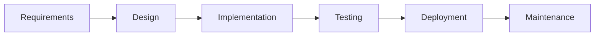
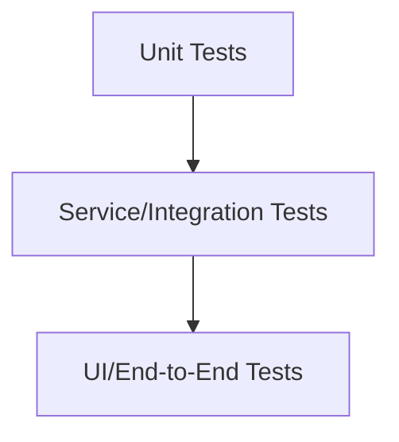
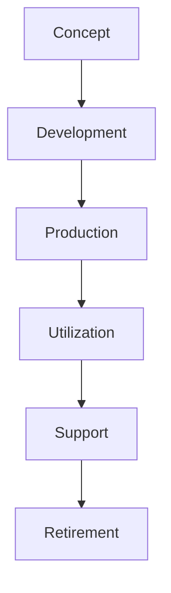
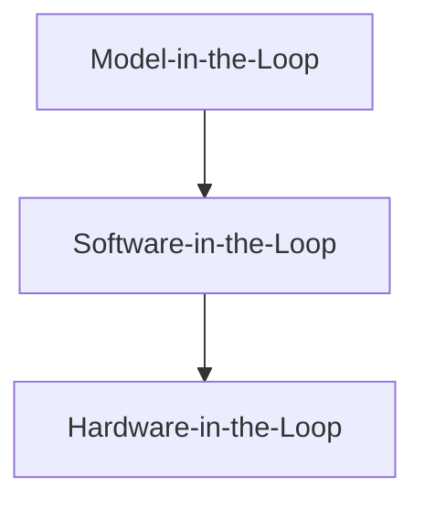

**NOTE**: This notebook is based on the following two ISTQB documents. It was prepared while studying for certification. For complete information, refer to the official ISTQB documents:

- [ISTQB_CTFL_Syllabus_v4.0.1.pdf](https://www.istqb.org/wp-content/uploads/2024/11/ISTQB_CTFL_Syllabus_v4.0.1.pdf)
- [ISTQB-CT-AuT_Syllabus_v1.0_2018.pdf](https://www.istqb.org/wp-content/uploads/2024/11/ISTQB-CT-AuT_Syllabus_v1.0_2018.pdf)

---

# 🧪 Software Testing Guide

## Table of Contents

1. [Basics of Testing](#1-basics-of-testing)
2. [Testing Throughout the SDLC](#2-testing-throughout-the-sdlc)
3. [Test Levels & Types](#3-test-levels--types)
4. [Static Testing](#4-static-testing)
5. [Test Techniques](#5-test-techniques)
6. [Collaboration-based Test Approaches](#6-collaboration-based-test-approaches)
7. [Test Management](#7-test-management)
8. [Risk Management](#8-risk-management)
9. [Test Monitoring & Reporting](#9-test-monitoring--reporting)
10. [Configuration Management](#10-configuration-management)
11. [Defect Management](#11-defect-management)
12. [Test Tools & Automation](#12-test-tools--automation)
13. [Automotive Software Testing](#13-automotive-software-testing)
14. [Glossary](#14-glossary)

---

## 1. Basics of Testing

Expand

### 1.1 What is Testing?

Testing assesses and improves software quality by discovering defects, verifying requirements, and validating user needs through both dynamic and static methods.

| Aspect         | Description                                                                 |
|----------------|-----------------------------------------------------------------------------|
| Objectives     | Find defects, verify requirements, validate user needs, ensure compliance   |
| Activities     | Planning, execution, reporting, defect management                           |
| Testing vs QA  | Testing is product-oriented; QA is process-oriented                         |

### 1.2 Testing Principles

| # | Principle Description                                      |
|---|-----------------------------------------------------------|
| 1 | Testing shows presence of defects, not their absence      |
| 2 | Exhaustive testing is impossible                          |
| 3 | Early testing saves time and money                        |
| 4 | Defects cluster together                                  |
| 5 | Repeated tests become less effective                      |
| 6 | Testing is context-dependent                              |
| 7 | Absence of defects ≠ system success                       |

### 1.3 Test Activities, Testware, and Roles

| Activity                | Description                                                                 |
|-------------------------|-----------------------------------------------------------------------------|
| Test Planning           | Define objectives, select approach, allocate resources                      |
| Test Monitoring/Control | Track progress, adjust plans                                                |
| Test Analysis           | Identify testable features, define conditions                               |
| Test Design             | Create test cases, define data and environment                              |
| Test Implementation     | Prepare testware, organize suites, set up environment                       |
| Test Execution          | Run tests, compare results, log anomalies                                   |
| Test Completion         | Archive testware, report, close environment                                 |

**Testware Examples:** Test plans, cases, scripts, logs, reports.

**Roles:** Test manager (process/leadership), Tester (technical execution).

### 1.4 Essential Skills & Good Practices

- Analytical, critical thinking, communication, technical/domain knowledge
- Whole team approach: everyone is responsible for quality
- Independence in testing: multiple levels (author, peer, independent team, external)

---

## 2. Testing Throughout the SDLC

Expand

### 2.1 SDLC Models & Testing

- **Sequential**: Waterfall, V-model
- **Iterative**: Spiral, Agile (Scrum, XP, Kanban)

### 2.2 Shift Left

- Early involvement of testing in SDLC
- Benefits: Early defect detection, cost savings

### 2.3 Testing as a Driver

- TDD, ATDD, BDD: Tests guide development
- Automated tests persist for future quality

### 2.4 DevOps & Testing

- CI/CD pipelines, fast feedback, automation
- Manual testing still needed for user perspective

### 2.5 Retrospectives

- Continuous improvement, lessons learned, team bonding

---

## 3. Test Levels & Types

Expand

### 3.1 Test Levels

| Level                    | Description                                    | Who Performs      |
|--------------------------|------------------------------------------------|-------------------|
| Component (Unit)         | Test smallest parts in isolation               | Developers        |
| Integration              | Test interfaces between components             | Dev/Testers       |
| System                   | Test complete system                           | Testers           |
| Acceptance               | Validate against requirements                  | Users/Stakeholders|

### 3.2 Test Types

| Type           | Focus                        | Example Techniques         |
|----------------|-----------------------------|---------------------------|
| Functional     | What system does             | Black-box, BVA, EP        |
| Non-Functional | How system behaves           | Performance, Security     |
| Structural     | Internal structure           | White-box, Coverage       |
| Change-related | Impact of changes            | Regression, Confirmation  |

### 3.3 Confirmation & Regression Testing

- Confirmation: Ensures defect is fixed
- Regression: Ensures no adverse effects from changes

### 3.4 Maintenance Testing

- Corrective, adaptive, performance/maintainability improvements
- Impact analysis determines test scope

---

## 4. Static Testing

Expand

### 4.1 Static Testing Methods

- Reviews, walkthroughs, inspections (manual)
- Static analysis (tools)
- Early defect detection, cost savings

| Review Type   | Formality | Main Objective         |
|---------------|----------|------------------------|
| Informal      | Low      | Anomaly detection      |
| Walkthrough   | Medium   | Quality, consensus     |
| Technical     | High     | Decision making        |
| Inspection    | Highest  | Anomaly detection      |

### 4.2 Feedback & Review Process

- Early/frequent feedback prevents costly rework
- Roles: Manager, Author, Moderator, Scribe, Reviewer, Review Leader

---

## 5. Test Techniques

Expand

### 5.1 Black-Box Techniques

| Technique                | Description                                  |
|--------------------------|----------------------------------------------|
| Equivalence Partitioning | Divide input data into valid/invalid classes |
| Boundary Value Analysis  | Test at boundaries of input ranges           |
| Decision Table           | Test combinations of conditions/actions      |
| State Transition         | Test state changes and transitions           |

### 5.2 White-Box Techniques

| Technique                | Description                                  |
|--------------------------|----------------------------------------------|
| Statement Coverage       | Execute all statements                       |
| Branch Coverage          | Execute all branches/decisions               |
| MC/DC                    | Each condition independently affects outcome |

### 5.3 Experience-Based

- Error guessing, exploratory testing, checklist-based testing

---

## 6. Collaboration-based Test Approaches

Expand

### 6.1 Collaborative Practices

- Collaborative user story writing (3 C’s: Card, Conversation, Confirmation)
- Acceptance criteria: define user story acceptance
- ATDD: Acceptance Test-Driven Development

| Good User Stories (INVEST) |
|----------------------------|
| Independent                |
| Negotiable                 |
| Valuable                   |
| Estimable                  |
| Small                      |
| Testable                   |

---

## 7. Test Management

Expand

### 7.1 Test Artifacts

| Artifact         | Purpose                                  |
|------------------|------------------------------------------|
| Test Plan        | Objectives, scope, approach, resources   |
| Test Cases       | Steps, data, expected results            |
| Test Report      | Progress, metrics, summary               |

- Entry/Exit Criteria: Preconditions and completion conditions
- Estimation Techniques: Ratio, Delphi, Three-point
- Test Prioritization: Risk, Coverage, Requirements

### 7.2 Test Pyramid

- Lower layers: fast, isolated, many tests
- Upper layers: slow, complex, fewer tests

### 7.3 Testing Quadrants

| Quadrant | Viewpoint         | Focus                        | Example Activities         |
|----------|-------------------|------------------------------|---------------------------|
| Q1       | Tech, Support     | Unit/Integration, Automation | CI, component tests       |
| Q2       | Business, Support | Functional, API, Simulation  | User story, API tests     |
| Q3       | Business, Critique| Exploratory, UAT, Usability  | Manual, acceptance tests  |
| Q4       | Tech, Critique    | Non-functional, Smoke        | Performance, security     |

---

## 8. Risk Management

Expand

### 8.1 Risk Types

| Risk Type   | Examples                                      |
|-------------|-----------------------------------------------|
| Project     | Delays, budget overruns, resource issues      |
| Product     | Missing features, security flaws, failures    |

- Risk = Likelihood × Impact
- Risk analysis: Identify, assess, mitigate, monitor

---

## 9. Test Monitoring & Reporting

Expand

### 9.1 Metrics

| Metric Type      | Examples                                 |
|------------------|------------------------------------------|
| Progress         | % tests run, passed, failed              |
| Quality          | Defect density, mean time to failure     |
| Coverage         | Requirements, code, risk                 |

- Test Progress Reports: Ongoing, for control
- Test Completion Reports: At milestones, for summary

---

## 10. Configuration Management

Expand

### 10.1 Configuration Management Practices

- Version control for test artifacts
- Traceability between requirements, tests, and defects

---

## 11. Defect Management

Expand

### 11.1 Defect Lifecycle

| Field           | Description                              |
|-----------------|------------------------------------------|
| ID              | Unique identifier                        |
| Title           | Short summary                            |
| Steps           | How to reproduce                         |
| Expected/Actual | Results                                  |
| Severity        | Impact                                   |
| Status          | Open, Closed, Deferred, etc.             |

- Defect management process: log, analyze, classify, resolve, close

---

## 12. Test Tools & Automation

Expand

### 12.1 Tool Types

| Tool Type           | Purpose                               |
|---------------------|---------------------------------------|
| Test Management     | Plan, track, report                   |
| Static Analysis     | Code reviews, standards               |
| Automation          | Execute tests, measure coverage       |
| CI/CD               | Integrate, deliver, deploy            |

- Benefits: Speed, repeatability, coverage
- Risks: Maintenance, over-reliance, compatibility

---

## 13. Automotive Software Testing

Expand

### 13.1 Standards

| Standard      | Focus                                      |
|---------------|--------------------------------------------|
| ASPICE        | Process capability, improvement            |
| ISO 26262     | Functional safety, ASIL levels             |
| AUTOSAR       | Software architecture, interoperability    |

### 13.2 System Lifecycle

### 13.3 XiL Environments

| Environment | Use Case                    | Timing         |
|-------------|-----------------------------|---------------|
| MiL         | Early model validation      | Early         |
| SiL         | Software behavior           | Mid           |
| HiL         | Real hardware integration   | Late          |

### 13.4 Test Techniques

| Technique         | Description                                  |
|-------------------|----------------------------------------------|
| Back-to-Back      | Compare outputs of two implementations       |
| Fault Injection   | Simulate faults for robustness               |
| Requirements-based| Ensure all requirements are tested           |

### 13.5 Static Test Techniques

- MISRA-C:2012 for coding standards
- Requirements review: verifiable, unambiguous, consistent, complete, traceable, bounded, singular

### 13.6 Dynamic Test Techniques

| Technique                | Description                                  |
|--------------------------|----------------------------------------------|
| Condition Testing        | Cover true/false outcomes of conditions      |
| Multiple Condition       | Cover all combinations of conditions         |
| MC/DC                    | Each condition independently affects outcome |
| Back-to-Back             | Compare two implementations                  |
| Fault Injection          | Simulate faults for robustness               |
| Requirements-based       | Cover requirements with test cases           |

### 13.7 Comparison Table

| Standard   | Objective                                      | Focus                        | Dependency      |
|------------|------------------------------------------------|------------------------------|-----------------|
| ISO 26262  | Avoid risks from systematic/hardware failures  | E/E system requirements      | ASIL level      |
| ASPICE     | Assess process capability                      | Process assessment           | Not on ASIL     |

---

## 14. Glossary

| Acronym | Meaning                                  |
|---------|------------------------------------------|
| ASIL    | Automotive Safety Integrity Level        |
| MC/DC   | Modified Condition/Decision Coverage     |
| MiL     | Model-in-the-Loop                       |
| SiL     | Software-in-the-Loop                    |
| HiL     | Hardware-in-the-Loop                    |
| BVA     | Boundary Value Analysis                 |
| EP      | Equivalence Partitioning                |
| TDD     | Test-Driven Development                 |
| ATDD    | Acceptance Test-Driven Development      |
| BDD     | Behavior-Driven Development             |
| CI/CD   | Continuous Integration/Continuous Delivery |
| UAT     | User Acceptance Testing                 |
| AUTOSAR | Automotive Open System Architecture     |
| ASPICE  | Automotive SPICE (Software Process Improvement and Capability dEtermination) |
