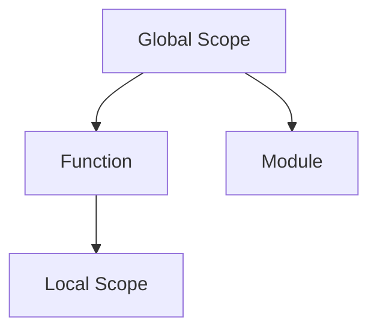

# 🐍 Python Introduction

---

## 1. 👋 Hello World

| Step | Description |
|------|-------------|
| 1    | Create a new file named `hello_world.py` |
| 2    | Type `print("Hello World !")` and save |
| 3    | Run: `python hello_world.py` in your terminal |
| 4    | Output: `Hello World !` |

```python
print("Hello World !")
```

---

## 2. 📝 Python Syntax & Structure

- **Whitespace (Indentation):** Defines code blocks (usually 4 spaces).
- **Comments:** Use `#` for single-line, triple quotes for multi-line.
- **Statements:** Instructions Python executes.
- **Keywords:** Reserved words with special meaning.
- **Built-in Types:** Numbers, strings, lists, dicts, etc.
- **Operators:** Symbols for operations.
- **Functions:** Reusable code blocks.
- **Control Flow:** `if`, `for`, `while`, etc.
- **Modules/Packages:** Organize code.

### 2.1 Indentation

```python
if True:
    print("This code will run.")
else:
    print("This code won't run.")
```

### 2.2 Comments

| Type        | Syntax Example                |
|-------------|------------------------------|
| Single-line | `# This is a comment`         |
| Multi-line  | `''' multi-line '''` or `""" multi-line """` |

```python
# Single-line comment

"""
Multi-line comment
spanning several lines.
"""
```

---

## 3. 🔑 Keywords

| Group        | Examples |
|--------------|----------|
| Boolean      | `True`, `False`, `None` |
| Control Flow | `if`, `elif`, `else`, `for`, `while`, `break`, `continue`, `pass` |
| Functions    | `def`, `return`, `lambda`, `yield` |
| Classes      | `class`, `is`, `as`, `from`, `import` |
| Exception    | `try`, `except`, `finally`, `raise`, `assert` |
| Others       | `and`, `or`, `not`, `with`, `global`, `nonlocal`, `del`, `async`, `await` |

> **Note:** Keywords cannot be used as variable names.

---

## 4. 📦 Built-in Types

| Category         | Types                                     |
|------------------|-------------------------------------------|
| Numeric          | `int`, `float`, `complex`                 |
| Boolean          | `bool`                                    |
| Sequence         | `list`, `tuple`, `range`                  |
| Text             | `str`                                     |
| Binary Sequence  | `bytes`, `bytearray`, `memoryview`        |
| Set              | `set`, `frozenset`                        |
| Mapping          | `dict`                                    |

---

## 5. 🔢 Operators

| Type         | Operators & Examples |
|--------------|---------------------|
| Arithmetic   | `+`, `-`, `*`, `/`, `//`, `%`, `**` |
| Comparison   | `==`, `!=`, `<`, `>`, `<=`, `>=`    |
| Logical      | `and`, `or`, `not`                  |
| Assignment   | `=`, `+=`, `-=`, `*=`, `/=`, `//=`  |
| Identity     | `is`, `is not`                      |
| Membership   | `in`, `not in`                      |
| Bitwise      | `&`, `|`, `^`, `~`, `<<`, `>>`      |

### 5.1 Arithmetic

```python
a, b = 10, 20
print(a + b)    # 30
print(a - b)    # -10
print(a * b)    # 200
print(a / b)    # 0.5
print(a // b)   # 0
print(a % b)    # 10
print(a ** b)   # 100000000000000000000
```

### 5.2 Comparison

```python
a, b = 10, 20
print(a == b)   # False
print(a != b)   # True
print(a < b)    # True
print(a > b)    # False
print(a <= b)   # True
print(a >= b)   # False
```

### 5.3 Logical

```python
a, b = 10, 20
print((a > 0) and (b < 20))  # False
print((a > 0) or (b < 20))   # True
print(not ((a > 0) and (b < 20))) # True
```

### 5.4 Assignment

```python
a = 10
a += 10
a -= 10
a *= 10
a /= 10
a //= 10
```

### 5.5 Identity

```python
a, b = 10, 20
print(a is b)      # False
print(a is not b)  # True
```

### 5.6 Membership

```python
line = 'hello python noob!'
print('noob' in line)      # True
print('noob' not in line)  # False
```

### 5.7 Bitwise

```python
print(0xFF & 0x10)
print(0xFF | 0x10)
print(0xFF ^ 0x10)
print(~3)
print(0xFF << 1)
print(0xFF >> 1)
```

> **Tip:** Operators have precedence (order of operations). Use parentheses to control evaluation order.

#### Operator Precedence (Highest to Lowest)

- Parentheses `()`
- Exponentiation `**`
- Unary `+`, `-`
- Multiplication, Division, Floor Division, Modulo `*`, `/`, `//`, `%`
- Addition, Subtraction `+`, `-`
- Bitwise Shifts `<<`, `>>`
- Bitwise AND `&`
- Bitwise XOR `^`
- Bitwise OR `|`
- Comparisons `==`, `!=`, `<`, `>`, `<=`, `>=`, `is`, `is not`, `in`, `not in`
- Logical NOT `not`
- Logical AND `and`
- Logical OR `or`
- Assignment `=`, `+=`, `-=`, etc.

---

## 6. 📦 Variables

Variables are named containers for storing data.
Python is dynamically typed (no need to declare type).

- Naming rules:
    - Start with letter/underscore, can contain numbers/underscores, case-sensitive, avoid keywords.
- Scope:
    - Local: Inside a function/block.
    - Global: Outside functions, accessible everywhere.

| Example | Description |
|---------|-------------|
| `name = "Chaitanya"` | String variable |
| `age = 30`           | Integer variable |
| `distance = 5.2`     | Float variable |

```python
name = "Chaitanya"
age = 30
distance = 5.2  # Can store floating-point numbers
```

### 6.1 ♻️ Variable Reassignment

```python
age = 30  # Initial assignment
age = 35  # Reassignment
```

### 6.2 🧠 Variable Scope



---

## 7. 🎛️ User Input

- Use `input("prompt")` to get user input (always returns a string).
- Convert input to other types as needed (`int()`, `float()`, etc.).
- Handle errors with `try-except`.

| Example | Description |
|---------|-------------|
| `name = input("What is your name? ")` | Get string input |
| `age = int(input("How old are you? "))` | Get integer input |

```python
try:
    number = float(input("Enter a number: "))
    result = number * 2
    print("The doubled number is:", result)
except ValueError:
    print("Invalid input: Please enter a number.")
```

---

## 8. 🔀 Control Flow (Overview)

| Statement | Purpose |
|-----------|---------|
| `if`, `elif`, `else` | Conditional execution |
| `for`, `while`       | Loops |
| `break`, `continue`  | Loop control |

```python
if age > 18:
    print("Adult")
else:
    print("Minor")
```

---

## 9. 🧩 Functions (Overview)

- Define with `def` keyword.
- Can take arguments and return values.

| Example | Description |
|---------|-------------|
| `def greet(name):` | Function definition |
| `return`           | Return a value |

```python
def greet(name):
    return f"Hello, {name}!"
```

---

## 10. 📦 Modules & Packages (Overview)

- **Module:** A single `.py` file with functions, classes, variables.
- **Package:** A directory with `__init__.py` and modules.

| Example | Description |
|---------|-------------|
| `import math` | Import a module |
| `from math import sqrt` | Import specific function |

```python
import math
print(math.sqrt(16))
```