# 🧠 if, elif, else in Python

## 🔎 What is if...elif...else?

The `if`...`elif`...`else` statement is a fundamental control structure in Python for making decisions based on conditions. It lets your program choose different paths of execution depending on whether certain conditions are `True` or `False`.

## 📝 Syntax

```python
if condition1:
    # Code to execute if condition1 is True
    print('inside condition 1')
elif condition2:
    # Code to execute if condition1 is False and condition2 is True
    print('inside condition 2')
else:
    # Code to execute if all conditions are False
    print('all above conditions failed. i am inside else part now 😂')
```

- The program checks each condition in order.
- The first condition that is `True` will have its block executed.
- Once a block is executed, the rest are skipped.

## 🔬 How it Works

| Statement   | When it Executes                                      |
|-------------|------------------------------------------------------|
| `if`        | If `condition1` is `True`                            |
| `elif`      | If `condition1` is `False` and `condition2` is `True`|
| `else`      | If all previous conditions are `False`                |

## 💡 Example

```python
from random import randint
grade = randint(70, 100)

if grade == 100:
    print("Perfect score! 🎉")
elif grade >= 90:
    print("Excellent! You got an A.")
elif grade >= 80:
    print("Great job! You got a B.")
else:
    print("Keep studying! You got a C or below.")
```

### 📝 Explanation

| Step | Description |
|------|-------------|
| 1    | Generates a random grade between 70 and 100. |
| 2    | Checks for perfect score, then for `A`, `B`, or lower. |

## 📊 Comparison Table

| Grade Range | Output Message                              |
|-------------|---------------------------------------------|
| 100         | 🎉 Perfect score!                           |
| 90 - 99     | 🅰️ Excellent! You got an A.                |
| 80 - 89     | 🅱️ Great job! You got a B.                 |
| 70 - 79     | 🆗 Keep studying! You got a C or below.     |

## 🌳 Flowchart

```mermaid
flowchart TD
    A[Start] --> B{grade == 100?}
    B -- Yes --> C[Perfect score! 🎉]
    B -- No --> D{grade >= 90?}
    D -- Yes --> E[Excellent! You got an A.]
    D -- No --> F{grade >= 80?}
    F -- Yes --> G[Great job! You got a B.]
    F -- No --> H[Keep studying! You got a C or below.]
    C --> I[End]
    E --> I
    G --> I
    H --> I
```



## 🛠️ Tips

| 💡 Tip | Description |
|--------|-------------|
| ✅     | You can have multiple `elif` conditions for more scenarios. |
| ✅     | The `else` block is optional, but recommended for completeness. |
| ✅     | Indentation is crucial! Use 4 spaces per block. |
| ✅     | Only the first `True` condition's block runs; others are skipped. |

## ⚠️ Common Pitfalls

| ⚠️ Pitfall                 | How to Avoid                                      |
|---------------------------|---------------------------------------------------|
| Missing indentation       | Always indent code blocks under `if`, `elif`, `else` |
| Using `=` instead of `==` | Use `==` for comparison, `=` for assignment       |
| Forgetting the colon `:`  | Every `if`, `elif`, `else` line ends with `:`     |
| Overlapping conditions    | Order matters; arrange from most specific to least|

## 🔀 Variations

| Variation         | Example                                   | Description                                 |
|-------------------|-------------------------------------------|---------------------------------------------|
| Only `if`         | `if x > 0: print("Positive")`             | Executes block if condition is `True`.      |
| `if` + `else`     | `if x > 0: ... else: ...`                 | Handles two possibilities.                  |
| Multiple `elif`   | `if x > 0: ... elif x == 0: ... else: ...`| Handles more than two possibilities.        |
| Nested `if`       | `if x > 0: if x > 10: ...`                | `if` inside another `if` for complex logic. |

## 🧪 Practice Exercises

1. Write a program to check if a number is positive, negative, or zero.
2. Write a program to assign grades (`A`, `B`, `C`, `D`, `F`) based on a score.
3. Modify the example to add a message for perfect score (100).

By mastering `if...elif...else` statements, you can write Python programs that make smart decisions and respond to different situations!