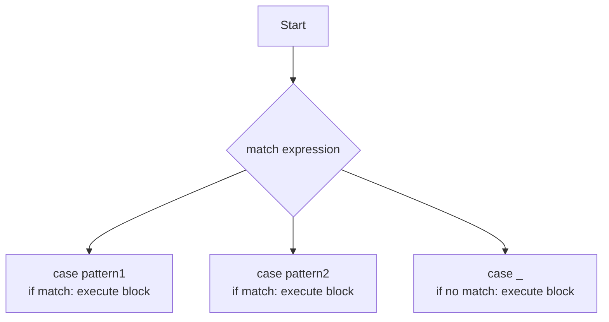

# 🧩 match-case Statement in Python

The `match-case` statement, introduced in Python 3.10, provides a powerful and readable way to perform pattern matching and conditional branching. It is especially useful for replacing complex `if-elif-else` chains and for working with structured data.

---

## 📚 Overview

| Feature         | Description                                                                 |
|-----------------|-----------------------------------------------------------------------------|
| Introduced in   | Python 3.10                                                                 |
| Purpose         | Pattern matching and conditional branching                                   |
| Alternative to  | `if-elif-else` chains                                                       |
| Use Cases       | Matching literals, structures, class instances, and more                    |
| Compatibility   | Not available in Python < 3.10                                              |

---

## 📝 Syntax & Components

```python
match expression:
    case pattern1:
        # Code if expression matches pattern1
    case pattern2:
        # Code if expression matches pattern2
    case _:  # Wildcard pattern (optional)
        # Code if no other pattern matches
```

| Component           | Description                                                                                         |
|---------------------|-----------------------------------------------------------------------------------------------------|
| `match expression`  | The value to match against patterns.                                                                |
| `case pattern`      | Each `case` defines a pattern to match (literal, variable, structure, etc.).                        |
| `case _`            | Wildcard (catch-all) pattern, executed if no other pattern matches.                                 |

---

## 🎯 When to Use match-case

- Multiple conditions based on a single value or structure.
- Complex patterns or comparisons.
- Improved code readability and maintainability.

---

## ⚠️ Considerations

| Point                                   | Details                                                                 |
|------------------------------------------|-------------------------------------------------------------------------|
| Python Version                          | Only available in Python 3.10 and above                                 |
| Backward Compatibility                  | Use `if-elif-else` for older Python versions                            |
| Not Always a Replacement                | Use the approach that best fits your use case                           |

---

## 🌟 Advantages

| Advantage             | Description                                                                 |
|-----------------------|-----------------------------------------------------------------------------|
| Readability           | Simplifies complex conditional logic                                        |
| Exhaustiveness        | Some IDEs can check for unused patterns                                     |
| Pattern Matching      | Easily match and destructure data structures                                |

---

## 🧩 Pattern Matching Capabilities

| Pattern Type         | Example                                  | Description                                      |
|----------------------|------------------------------------------|--------------------------------------------------|
| Literal              | `case 1:`                                | Matches exact value                              |
| Variable             | `case x:`                                | Binds value to variable                          |
| Sequence             | `case [x, y]:`                           | Matches lists/tuples of specific length          |
| Mapping              | `case {"key": value}:`                   | Matches dicts with specific keys                 |
| Class                | `case Point(x, y):`                      | Matches class instances and extracts attributes  |
| OR Pattern           | `case 1 | 2 | 3:`                        | Matches any of the listed values                 |
| Wildcard             | `case _:`                                | Matches anything (default/catch-all)             |

---

## 🧑‍💻 Examples

### Basic Example

```python
from random import randint
grade = randint(50, 100)

match grade:
    case grade if 90 <= grade <= 100:
        print("Excellent! You got an A.")
    case grade if 80 <= grade < 90:
        print("Great job! You got a B.")
    case grade if 70 <= grade < 80:
        print("You got a C. Keep practicing!")
    case _:
        print("Study hard! You got a D or below.")
```

### Matching Tuples

```python
point = (0, 1)
match point:
    case (0, 0):
        print("Origin")
    case (0, y):
        print(f"Y={y} on Y-axis")
    case (x, 0):
        print(f"X={x} on X-axis")
    case (x, y):
        print(f"Point at X={x}, Y={y}")
```

### Matching Dictionaries

```python
person = {"name": "Alice", "age": 30}
match person:
    case {"name": name, "age": age}:
        print(f"{name} is {age} years old.")
    case _:
        print("Unknown format")
```

---

## 🗂️ Visual Flow



---

## 🔗 References

- [PEP 634 – Structural Pattern Matching](https://peps.python.org/pep-0634/)
- [Python Docs: match statement](https://docs.python.org/3/reference/compound_stmts.html#the-match-statement)