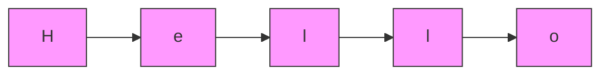

# 🧵 Strings in Python

Strings are fundamental data structures used to represent sequences of characters. They can store text, numbers (as text), symbols, and more.

---

## ✨ Creating Strings

You can create strings in Python using single, double, or triple quotes:

| Syntax            | Example                                 | Description                      |
|-------------------|-----------------------------------------|----------------------------------|
| Single quotes     | `'Hello'`                               | Simple string                    |
| Double quotes     | `"Hello"`                               | Simple string                    |
| Triple quotes     | `'''Hello'''` or `"""Hello"""`          | Multi-line or complex strings    |

```python
my_string_1 = 'Hello, 🌏!'
my_string_2 = "This is also a string."
string_with_quotes = 'He said, "🙏!"'

multiline_text = """This is a string
that spans multiple lines."""
```

---

## 🔢 String Indexing & Slicing

Strings are sequences of characters, where each character has an index.

| Operation   | Syntax           | Example                  | Result         |
|-------------|------------------|--------------------------|---------------|
| Indexing    | `string[i]`      | `name[0]`                | `'C'`         |
| Negative    | `string[-1]`     | `name[-1]`               | `'a'`         |
| Slicing     | `string[a:b]`    | `greeting[7:9]`          | `'🌏!'`        |

```python
name = "Chaitanya"
first_letter = name[0]  # 'C'
last_letter = name[-1]  # 'a'

greeting = "Hello, 🌏!"
substring = greeting[7:9]  # '🌏!'
```

---

## 🛠️ String Operations

### Concatenation

Combine strings using the `+` operator.

```python
first_name = "Chaitanya"
last_name = "Reddy"
full_name = first_name + " " + last_name
print(full_name)  # Output: Chaitanya Reddy
```

### Repetition

Repeat a string using the `*` operator.

```python
echo = "Hi! " * 3
print(echo)  # Output: Hi! Hi! Hi!
```

---

## 🧩 String Formatting

| Method         | Example                                               | Output                                 |
|----------------|------------------------------------------------------|----------------------------------------|
| f-string       | `f"Hi {name}, you are {age} years old."`             | `Hi Chaitanya, you are 30 years old.`  |
| `.format()`    | `"Welcome, {}!".format(name)`                        | `Welcome, Chaitanya!`                  |
| `%` operator   | `"Hello, %s!" % name`                                | `Hello, Chaitanya!`                    |

```python
name = "Chaitanya"
age = 30
message = f"Hi {name}, you are {age} years old."
print(message)

greeting = "Welcome, {}!".format(name)
print(greeting)

legacy = "Hello, %s!" % name
print(legacy)
```

---

## 🧰 Common String Methods

| Method                  | Description                                   | Example                                 | Output                  |
|-------------------------|-----------------------------------------------|-----------------------------------------|-------------------------|
| `len(string)`           | Length of string                              | `len("Hello")`                          | `5`                     |
| `upper()`               | Convert to uppercase                          | `"hello".upper()`                       | `'HELLO'`               |
| `lower()`               | Convert to lowercase                          | `"HELLO".lower()`                       | `'hello'`               |
| `strip()`               | Remove leading/trailing whitespace            | `"  hi  ".strip()`                      | `'hi'`                  |
| `find(sub)`             | Find substring index, -1 if not found         | `"hello".find("e")`                     | `1`                     |
| `replace(old, new)`     | Replace substring                             | `"hi chaitu".replace("chaitu", "all")`  | `'hi all'`              |
| `split(sep)`            | Split string into list                        | `"a,b,c".split(",")`                    | `['a', 'b', 'c']`       |
| `join(list)`            | Join list into string                         | `",".join(['a','b','c'])`               | `'a,b,c'`               |
| `startswith(prefix)`    | Check if string starts with prefix            | `"hello".startswith("he")`              | `True`                  |
| `endswith(suffix)`      | Check if string ends with suffix              | `"hello".endswith("lo")`                | `True`                  |

```python
line = ' Hi Chaitanya, you are 30 years old'

print(len(line))
print(line.upper())
print(line.lower())
print(line.strip())
print(line.find('30'))
print(line.replace('Chaitanya', 'Chaitu'))
print(line.split(','))
print(','.join(['a', 'b', 'c']))
print(line.startswith(' Hi'))
print(line.endswith('old'))
```

---

## 🧭 String Immutability

Strings in Python are **immutable**. Once created, their contents cannot be changed.

```python
s = "hello"
# s[0] = 'H'  # ❌ This will raise an error!
s = "Hello"   # ✔️ You can assign a new string to the variable
```

---

## 🗺️ String Memory Layout (Mermaid Diagram)



---

## 📝 Summary Table

| Feature           | Example                      | Description                      |
|-------------------|-----------------------------|----------------------------------|
| Creation          | `'Hello'`, `"World"`         | Single/Double/Triple quotes      |
| Indexing          | `s[0]`                       | Access character                 |
| Slicing           | `s[1:4]`                     | Substring                        |
| Concatenation     | `s1 + s2`                    | Combine strings                  |
| Repetition        | `s * 3`                      | Repeat string                    |
| Formatting        | `f"Hi {name}"`               | Insert variables                 |
| Methods           | `s.upper()`, `s.strip()`     | Common operations                |
| Immutability      | `s[0] = 'H' # Error`         | Cannot change in-place           |