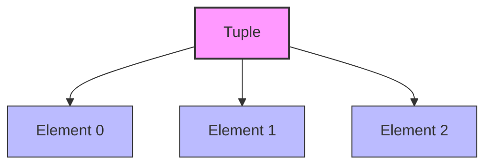

# 🍇 Tuples in Python

Tuples are a fundamental, immutable data structure in Python, used to store ordered collections of items.

## 📝 Key Characteristics

| Feature         | Description                                                                 |
|-----------------|-----------------------------------------------------------------------------|
| **Ordered**     | Elements are stored in a specific order and can be accessed by index.        |
| **Immutable**   | Once created, elements cannot be modified, added, or removed.                |
| **Parentheses** | Defined using parentheses `()`.                                              |
| **Indexing**    | Supports zero-based and negative indexing.                                   |
| **Slicing**     | Extract portions using `[start:end:step]`.                                   |
| **Hashable**    | Usable as dictionary keys if all elements are hashable.                      |

## 🛠️ Creating Tuples

```python
fruits = ("🍎", "🍌", "🍒")
numbers = (1, 2, 3)
single = (42,)      # Note the comma for single-element tuples
empty = ()
coords = 1, 2, 3    # Parentheses are optional, but recommended
```

## 🔍 Accessing Elements

```python
first_fruit = fruits[0]     # "🍎"
last_number = numbers[-1]   # 3
subtuple = fruits[1:3]      # ("🍌", "🍒")
```

## 🚫 Immutability

Tuples cannot be changed after creation:

```python
fruits[0] = "🥭"  # TypeError: 'tuple' object does not support item assignment
```

## 🔄 Common Operations

| Operation                | Example                        | Result / Description                  |
|--------------------------|--------------------------------|---------------------------------------|
| Length                   | `len(fruits)`                  | `3`                                   |
| Membership               | `"🍎" in fruits`               | `True`                                |
| Conversion from iterable | `tuple([1, 2, 3])`             | `(1, 2, 3)`                           |
| Concatenation            | `(1, 2) + (3, 4)`              | `(1, 2, 3, 4)`                        |
| Repetition               | `("a",) * 3`                   | `("a", "a", "a")`                     |
| Count                    | `fruits.count("🍎")`            | `1`                                   |
| Index                    | `fruits.index("🍌")`            | `1`                                   |

## 🔁 Looping

```python
for fruit in fruits:
    print(fruit)
```

## 🧩 Tuple Unpacking

Assign tuple elements to variables in one step:

```python
point = (3, 4)
x, y = point  # x = 3, y = 4
```

## ⚡ Tuple Comprehension

> Parentheses with a comprehension create a generator, not a tuple.

```python
squares = (i**2 for i in range(10))  # generator
squares_tuple = tuple(i**2 for i in range(10))  # tuple
```

## 🏷️ Named Tuples

Use `collections.namedtuple` for readable, field-named tuples:

```python
from collections import namedtuple

Person = namedtuple("Person", ["name", "age"])
alice = Person("Alice", 30)
print(alice.name)  # Alice
```

## 🗺️ Tuples as Dictionary Keys

Tuples can be dictionary keys if all elements are hashable:

```python
locations = { (40.7128, -74.0060): "New York", (51.5074, -0.1278): "London" }
```

## 🧠 When to Use Tuples

- When you need a collection that should not change.
- To represent fixed data sets or configuration values.
- As dictionary keys.
- For unpacking multiple values at once.

## 🖼️ Tuple Structure (Mermaid Diagram)



## 📝 Summary

- Tuples are ordered, immutable collections.
- Support indexing, slicing, and unpacking.
- Useful for fixed data sets, configuration, and as dictionary keys.
- Use `tuple()` to convert other iterables.
- Use named tuples for more readable code.