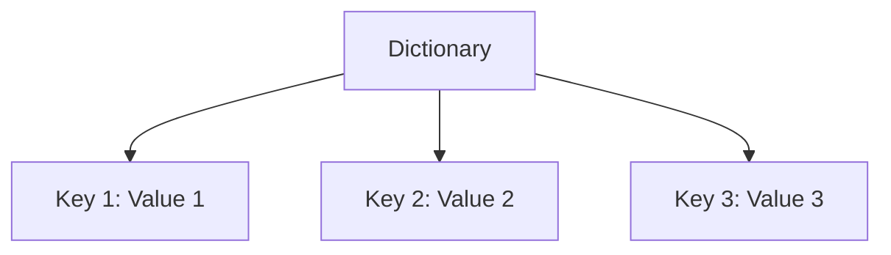

# 🗝️ Python Dictionary

Dictionaries are fundamental data structures in Python that store collections of items as **key-value** pairs. They allow fast lookups and flexible data organization by associating unique, immutable keys with values of any data type.

---

## ✨ Key Features

| Feature        | Description                                                                 |
|----------------|-----------------------------------------------------------------------------|
| **Syntax**     | Curly braces `{}` with key-value pairs separated by colons `:`              |
| **Keys**       | Unique and immutable (e.g., strings, numbers, tuples)                       |
| **Values**     | Any data type (strings, numbers, lists, other dictionaries, etc.)           |
| **Mutability** | Dictionaries are mutable; you can add, modify, or remove items after creation|
| **Order**      | Preserves insertion order (Python 3.7+)                                     |

---

## 🛠️ Basic Operations

| Operation        | Syntax / Example             | Description                        |
|------------------|-----------------------------|------------------------------------|
| **Create**       | `d = {"a": 1, "b": 2}`      | Create a dictionary                |
| **Access**       | `d["a"]`                    | Get value for key `"a"`            |
| **Add/Update**   | `d["c"] = 3`                | Add or update key-value pair       |
| **Delete**       | `del d["b"]`                | Remove key `"b"` and its value     |
| **Check key**    | `"a" in d`                  | Returns `True` if key exists       |
| **Length**       | `len(d)`                    | Number of key-value pairs          |

---

## 📋 Common Methods

| Method                  | Description                                               |
|-------------------------|-----------------------------------------------------------|
| `get(key, default)`     | Returns value for key, or default if key not found        |
| `keys()`                | Returns a view of all keys                                |
| `values()`              | Returns a view of all values                              |
| `items()`               | Returns a view of all key-value pairs as tuples           |
| `pop(key, default)`     | Removes key and returns its value, or default if missing  |
| `popitem()`             | Removes and returns the last inserted key-value pair      |
| `clear()`               | Removes all items                                         |
| `update(other_dict)`    | Updates with key-value pairs from another dictionary      |

---

## 🧑‍💻 Examples

### Creating and Modifying Dictionaries

```python
# Create a dictionary
person = {"name": "Alice", "age": 30, "city": "New York"}

# Access a value
print(person["name"])  # Output: Alice

# Add or update a key-value pair
person["email"] = "alice@example.com"
person["age"] = 31

# Remove a key-value pair
del person["city"]

# Check if a key exists
if "email" in person:
    print("Email found!")
```

### Using Methods

```python
# Using get with a default value
phone = person.get("phone", "N/A")  # Returns "N/A" if "phone" not found

# Iterating over keys and values
for key, value in person.items():
    print(f"{key}: {value}")

# Merging dictionaries
defaults = {"theme": "light", "language": "en"}
settings = {"theme": "dark"}
defaults.update(settings)
print(defaults)  # {'theme': 'dark', 'language': 'en'}
```

---

## 🔄 Iteration

```python
# Iterate over keys
for key in person:
    print(key, person[key])

# Iterate over key-value pairs
for key, value in person.items():
    print(f"{key}: {value}")

# Iterate over values
for value in person.values():
    print(value)
```

---

## 🧩 When to Use Dictionaries

- Associate data with unique identifiers or labels.
- Store configuration settings, user preferences, or mappings.
- Build complex data structures (e.g., nested dictionaries).

---

## 🗂️ Structure (Mermaid Diagram)



---

## 📝 Key Points

- Keys must be unique and immutable.
- Values can be any data type.
- Dictionaries are mutable and preserve insertion order.
- Use built-in methods to add, remove, access, and iterate over elements.

---