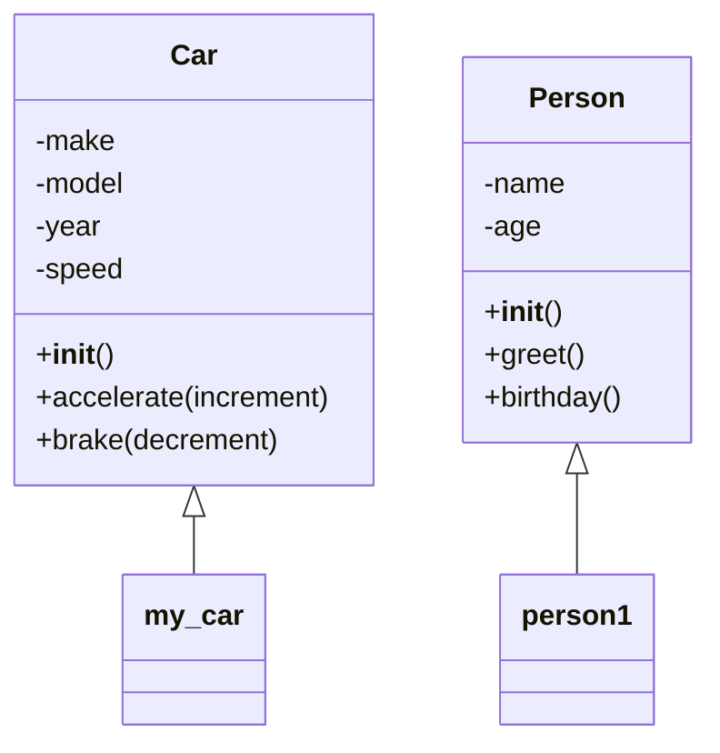

# 🚗 Object-Oriented Programming (OOP) in Python

## 📝 Introduction

Object-Oriented Programming (OOP) is a paradigm based on the concept of "objects", which encapsulate data (attributes) and behavior (methods). In Python, classes are the foundation of OOP, serving as blueprints for creating objects (instances).

## 🏗️ 1. Defining a Class

- Use the `class` keyword to define a class.
- Classes encapsulate data and behavior.

```python
class Car:
    """A simple Car class."""

    def __init__(self, make, model, year):
        self.make = make
        self.model = model
        self.year = year
        self.speed = 0  # New attribute

    def accelerate(self, increment=10):
        """Increase the car's speed."""
        self.speed += increment
        print(f"{self.make} {self.model} accelerates to {self.speed} km/h.")

    def brake(self, decrement=10):
        """Decrease the car's speed."""
        self.speed = max(0, self.speed - decrement)
        print(f"{self.make} {self.model} slows down to {self.speed} km/h.")
```

**Key Points:**
- `__init__` is the constructor, initializing the object's attributes.
- Methods are functions defined inside a class to perform actions on the object's data.

## 🧑‍💻 2. Creating and Using Objects

- Instantiate objects using the class name.
- Access attributes and methods with dot notation.

```python
my_car = Car("Ford", "Mustang", 2023)
my_car.accelerate()      # Ford Mustang accelerates to 10 km/h.
my_car.accelerate(20)    # Ford Mustang accelerates to 30 km/h.
my_car.brake()           # Ford Mustang slows down to 20 km/h.
print(my_car.year)       # 2023
```

## 🛠️ 3. Methods in Classes

- Methods are functions defined inside a class.
- The first parameter is always `self`, referring to the instance.

```python
class Person:
    def __init__(self, name, age):
        self.name = name
        self.age = age

    def greet(self):
        print(f"Hello, my name is {self.name}!")

    def birthday(self):
        self.age += 1
        print(f"Happy birthday {self.name}, you are now {self.age}!")
```

**Example usage:**

```python
person1 = Person("Alice", 30)
person1.greet()          # Hello, my name is Alice!
person1.birthday()       # Happy birthday Alice, you are now 31!
```

## 🧩 4. Types of Methods

| Type                | Purpose                                      | Example Syntax                |
|---------------------|----------------------------------------------|-------------------------------|
| Constructor         | Initializes the object's attributes          | `def __init__(self, ...)`     |
| Accessor (Getter)   | Retrieves the value of an attribute          | `def get_name(self): ...`     |
| Mutator (Setter)    | Modifies the value of an attribute           | `def set_age(self, new_age):` |
| Custom/Other        | Defines custom functionalities               | `def greet(self): ...`        |

**Example:**

```python
class Example:
    def __init__(self, value):
        self._value = value  # Convention: _value is "protected"

    def get_value(self):      # Accessor
        return self._value

    def set_value(self, v):   # Mutator
        if v >= 0:
            self._value = v
        else:
            print("Value must be non-negative.")
```

## 🏆 5. Benefits of Using Classes and Methods

| Benefit                | Description                                                                 |
|------------------------|-----------------------------------------------------------------------------|
| Code Reusability       | Create multiple objects from a single class, reducing code duplication.     |
| Maintainability        | Changes to the class definition affect all its instances.                   |
| Data Encapsulation     | Control access to attributes and methods, protecting data integrity.        |
| Modularity             | Objects encapsulate data and functionality, promoting modular design.       |
| Object-Oriented Design | Classes are fundamental for building complex and well-structured programs.  |

## 🧠 Key Concepts Table

| Concept         | Description                                                                 |
|-----------------|-----------------------------------------------------------------------------|
| Class           | Blueprint for creating objects (instances).                                 |
| Object          | Instance of a class, encapsulating data and behavior.                       |
| Attribute       | Variable that belongs to an object or class.                                |
| Method          | Function defined inside a class, operates on object data.                   |
| `self`          | Refers to the current instance of the class.                                |
| Constructor     | Special method (`__init__`) to initialize object attributes.                |

## 🗺️ OOP Structure Diagram



## 🧪 Additional Example: Inheritance and Composition

```python
class Engine:
    def __init__(self, horsepower):
        self.horsepower = horsepower

class SportsCar(Car):
    def __init__(self, make, model, year, horsepower):
        super().__init__(make, model, year)
        self.engine = Engine(horsepower)

    def show_specs(self):
        print(f"{self.make} {self.model} ({self.year}) - {self.engine.horsepower} HP")

my_sports_car = SportsCar("Porsche", "911", 2024, 473)
my_sports_car.show_specs()  # Porsche 911 (2024) - 473 HP
```

## 📌 Summary

- Classes define blueprints for objects.
- Objects encapsulate data (attributes) and behavior (methods).
- The `__init__` method initializes object attributes.
- Methods operate on object data, using `self`.
- OOP promotes code reuse, modularity, and data integrity.

## 🧪 Practice Exercises

1. Create a class called `Book` with attributes for title, author, and pages. Include methods to get the book's info and to check if it's a long book (e.g., over 300 pages).
2. Implement a class `Rectangle` with methods to calculate its area and perimeter.
3. Create a class `BankAccount` with methods to deposit, withdraw, and check the balance.
4. Implement a class `Person` with attributes for name and age, and a method to celebrate a birthday (increment age).
5. Create a class `Circle` with a method to calculate its area given the radius.
