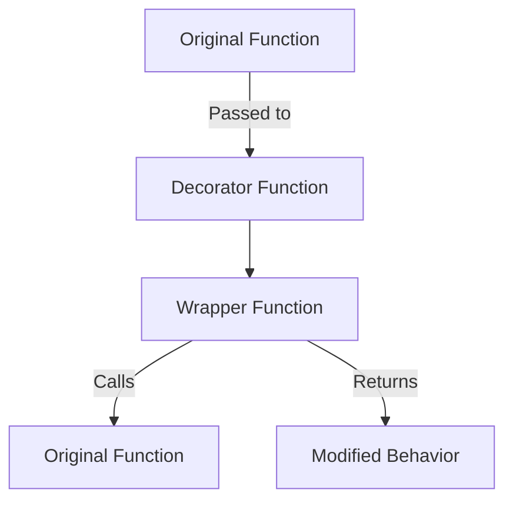

# 🧩 Python Decorators

## 📝 Overview

Decorators are a powerful and flexible design pattern in Python that allow you to **modify or enhance the behavior of functions or classes** without permanently changing their source code. They are widely used for logging, authentication, error handling, caching, and more.

## ❓ What is a Decorator?

- A **decorator** is a function that takes another function (or class) as an argument and returns a new function with added or altered behavior.
- Decorators help keep code **clean, DRY (Don't Repeat Yourself), and reusable**.

## 🛠️ How Decorators Work

### Basic Structure

```python
def decorator_function(original_function):
    def wrapper_function(*args, **kwargs):
        # Code before
        result = original_function(*args, **kwargs)
        # Code after
        return result
    return wrapper_function
```

### Applying a Decorator

You can apply a decorator using the `@` syntax:

```python
@decorator_function
def my_function():
    print("Hello!")
```

This is equivalent to:

```python
def my_function():
    print("Hello!")

my_function = decorator_function(my_function)
```

## 🧑‍💻 Example 1: Simple Decorator

```python
def my_decorator(func):
    def wrapper():
        print("Before function call")
        func()
        print("After function call")
    return wrapper

@my_decorator
def say_hello():
    print("Hello from the decorated function!")

say_hello()
# Output:
# Before function call
# Hello from the decorated function!
# After function call
```

## 🧑‍💻 Example 2: Decorator with Arguments

```python
def repeat(num_times):
    def decorator_repeat(func):
        def wrapper(*args, **kwargs):
            for _ in range(num_times):
                func(*args, **kwargs)
        return wrapper
    return decorator_repeat

@repeat(3)
def greet():
    print("Hello!")

greet()
# Output:
# Hello!
# Hello!
# Hello!
```

## 🧑‍💻 Example 3: Decorator for Logging

```python
def log_calls(func):
    def wrapper(*args, **kwargs):
        print(f"Calling {func.__name__} with {args} {kwargs}")
        result = func(*args, **kwargs)
        print(f"{func.__name__} returned {result}")
        return result
    return wrapper

@log_calls
def add(a, b):
    return a + b

add(2, 3)
# Output:
# Calling add with (2, 3) {}
# add returned 5
```

## 🧑‍💻 Example 4: Stacking Multiple Decorators

```python
def uppercase(func):
    def wrapper(*args, **kwargs):
        result = func(*args, **kwargs)
        return result.upper()
    return wrapper

def exclaim(func):
    def wrapper(*args, **kwargs):
        result = func(*args, **kwargs)
        return result + "!"
    return wrapper

@exclaim
@uppercase
def greet(name):
    return f"hello {name}"

print(greet("world"))
# Output: HELLO WORLD!
```

## 🧠 Explanation Table

| Component         | Description                                                                 |
|-------------------|-----------------------------------------------------------------------------|
| Decorator         | Function that takes another function as input                               |
| Wrapper           | Inner function that adds extra behavior before/after the original call      |
| `@decorator`      | Syntactic sugar for applying the decorator                                  |
| Decorator with Args | Decorator that itself takes arguments and returns a decorator             |
| Stacked Decorators | Multiple decorators applied to a single function                           |

## ⚡ Common Use Cases

| Use Case                   | Description                                                                 |
|----------------------------|-----------------------------------------------------------------------------|
| **Logging**                | Record information about function calls and results                         |
| **Authentication**         | Check user permissions before executing a function                          |
| **Error Handling**         | Centralize error management for functions                                   |
| **Caching**                | Store results of expensive function calls                                   |
| **Performance Measurement**| Measure and log execution time                                              |

## 🏗️ Decorator Flow (Mermaid Diagram)



## 🏷️ Key Points

- Decorators **modify or enhance** function/class behavior without changing their source code.
- They **promote code reusability** and separation of concerns.
- The `@` syntax is a concise and readable way to apply decorators.
- Decorators can be **stacked** (multiple decorators on a single function).
- Decorators can accept their own arguments by adding another level of function nesting.

## 📚 Summary Table

| Feature                | Description                                      |
|------------------------|--------------------------------------------------|
| Decorator              | Function that modifies another function/class    |
| `@decorator` syntax    | Syntactic sugar for applying decorators          |
| Wrapper Function       | Inner function that adds extra behavior          |
| Use Cases              | Logging, auth, error handling, caching, timing   |
| Arguments              | Decorators can accept arguments                  |
| Stacking               | Multiple decorators can be applied               |

> Decorators are a cornerstone of Python's expressive power—mastering them will make your code more modular, readable, and efficient.

## 🧪 Practice Exercises

1. Create a decorator that logs the execution time of a function.
2. Implement a decorator that checks if a user is authenticated before allowing access to a function.
3. Write a decorator that caches the results of a function to improve performance.
4. Create a decorator that limits the number of times a function can be called.
5. Implement a decorator that adds a prefix to the return value of a function.
