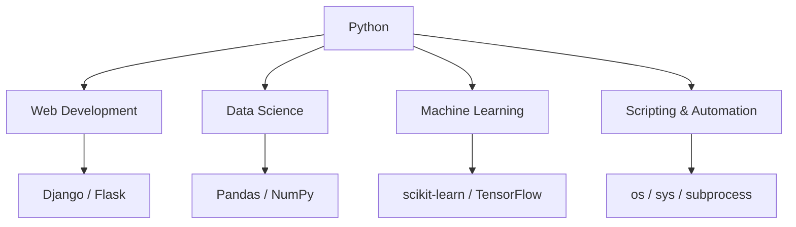

# 🐍 Python Introduction

> **Python** is a powerful, versatile, and beginner-friendly programming language with a huge ecosystem and community support.

<details>
<summary><strong>📚 Contents</strong></summary>

- [Why Python?](#-why-python)
- [Key Features](#-key-features)
- [Installation & Setup (Windows)](#-installation--setup---windows-only)
- [Getting Started](#-getting-started)
- [Python Virtual Environment](#-python-virtual-environment)
- [Hello World Example](#-hello-world-example)
- [Basic Syntax](#-basic-syntax)
- [Data Types](#-data-types)
- [Control Flow](#-control-flow)
- [Functions](#-functions)
- [Python Ecosystem Overview](#-python-ecosystem-overview)
- [Useful Python Resources](#-useful-python-resources)
- [Next Steps](#-next-steps)
</details>

---

## ❓ Why Python?

| Feature                | Description                                                                                  |
|------------------------|----------------------------------------------------------------------------------------------|
| **Beginner-Friendly**  | Clear, concise syntax resembling natural language.                                           |
| **Versatile**          | Used for web development, data science, machine learning, scripting, automation, and more.   |
| **Large Community**    | Vast ecosystem of libraries and frameworks, active community support.                        |

---

## ✨ Key Features

| Feature                     | Description                                                                                   |
|-----------------------------|-----------------------------------------------------------------------------------------------|
| **Dynamic Typing**          | No need to declare variable types; Python infers them automatically.                         |
| **Object-Oriented (OOP)**   | Supports classes and objects for better code organization.                                   |
| **Interpreted Language**    | Code is executed line by line, making development fast and interactive.                      |
| **Cross-Platform**          | Runs on Windows, macOS, Linux, and more.                                                     |
| **Extensive Libraries**     | Thousands of libraries for everything from web to AI.                                        |

---

## 💻 Installation & Setup - Windows Only

1. **Download Python**  
   - Get the latest version from the [official download page](https://www.python.org/downloads/windows/).
   - Follow the [installation instructions](https://docs.python.org/3/using/windows.html#the-full-installer).

2. **Other Platforms**  
   - See [downloads](https://www.python.org/downloads/) for macOS, Linux, etc.

3. **Verify Installation**  
   Open Command Prompt and run:
   ```bash
   python -V
   ```
   If installed correctly, the Python version will be displayed.

---

## 🚀 Getting Started

After installing Python, you can run a script by saving your code in a file (e.g., `hello.py`) and running:

```bash
python hello.py
```

---

## 🏗️ Python Virtual Environment

A virtual environment helps you manage dependencies for different projects and avoid conflicts.

| Step                | Command / Description                                           |
|---------------------|----------------------------------------------------------------|
| **Create venv**     | `python -m venv .venv`                                         |
| **Activate venv**   | `.venv\Scripts\activate` (Windows Command Prompt)              |
| **Upgrade pip**     | `python -m pip install --upgrade pip`                          |
| **Deactivate venv** | `deactivate`                                                   |

---

## 👋 Hello World Example

```python
print("Hello, World!")
```

---

## 📝 Basic Syntax

| Concept         | Example                         | Description                          |
|-----------------|---------------------------------|--------------------------------------|
| Comments        | `# This is a comment`           | Single-line comment                  |
| Indentation     | `    print("Indented")`         | Indentation defines code blocks      |
| Variables       | `x = 5`                         | No type declaration needed           |

---

## 🔢 Data Types

| Type      | Example           | Description                |
|-----------|-------------------|----------------------------|
| int       | `x = 10`          | Integer                    |
| float     | `y = 3.14`        | Floating point number      |
| str       | `name = "Alice"`  | String                     |
| bool      | `flag = True`     | Boolean                    |
| list      | `nums = [1,2,3]`  | List (array)               |
| dict      | `d = {"a": 1}`    | Dictionary (key-value)     |

---

## 🔁 Control Flow

| Statement   | Example                              | Description           |
|-------------|--------------------------------------|-----------------------|
| if/elif/else| `if x > 0: ... elif ... else ...`    | Conditional logic     |
| for loop    | `for i in range(5): ...`             | Loop over sequence    |
| while loop  | `while x < 10: ...`                  | Loop with condition   |

---

## 🧩 Functions

```python
def greet(name):
    return f"Hello, {name}!"
```

---

## 🗺️ Python Ecosystem Overview



---

## 🔗 Useful Python Resources

| Resource                | Link                                                      | Description                  |
|-------------------------|-----------------------------------------------------------|------------------------------|
| Official Docs           | [python.org/doc](https://docs.python.org/3/)              | Official documentation       |
| PyPI (Packages)         | [pypi.org](https://pypi.org/)                             | Python package repository    |
| Tutorials               | [Real Python](https://realpython.com/)                    | In-depth tutorials           |
| Interactive Learning    | [LearnPython](https://www.learnpython.org/)               | Hands-on Python practice     |

---

## ⏭️ Next Steps

- Learn about modules and packages
- Explore file I/O
- Understand error handling and exceptions
- Try building a small project

---
